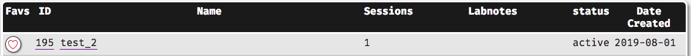
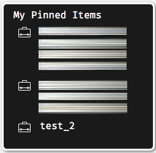

# Quick Reference Guide

This page is intended to be a quick reference guide and _not_ a subsitute for reading the appropriate sections of the manual relevant to your needs.

## Most Common Issues

For a list of the currently known bugs and workarounds see the section containing [known issues](#knownissues) and most [frequently asked questions](#faqs).

## Questionnaire Component Types

For more detailed information on the types of questionnaire components and the questions within see the section on mixed questionnaires in the [questionnaire component types](#quest_types) section.

```{r quest_types, echo = F, message = F}
quests <- read_csv("quest_spreadsheet_2.csv")

knitr::kable(quests)
```

## Experiment Component Types

For more detailed information on the types of experimental components please see the full section on [experimental component types](#exp_types).

```{r exp_types, echo = F, message = F}
exps <- read_csv("exp_spreadsheet.csv")

knitr::kable(exps)

# cannot for the life of me get a bulleted list inside a Kable. Even tried using pander. If I manage to get it I'll make this table more informative.
```

## Structuring Your Study

Sets and projects are used for structuring and delivering your project.

### Sets

Sets create the internal structure of your study using a combination of grouping of questionnaire and experimental components and decision rules which move participants between them. You must place individual components within at least one set before placing them in a project, as the set arrangement determines order of presentation of components.

For more information see the [sets](#sets) section of this site.

### Projects

Projects are the final "container" for the supersets, sets and individual components that you have made. This allows for the study to be presented to the participants. Here, you will assign a URL suffix that will allow your participants to access the study.

Projects do not allow for the automatic filtering of participants, as server-side calculations are not possible, however they may allow for simple branching based on participants self-selection into sets within the project.

For more information see the [projects](#projs) section of the site.

## Testing Your Study

**You must test your study before you ask your supervisor to make it live.**

For more information please see the section with recommendations on how to [test your study](#testingyourstudy) and the [student checklist](#checklist) before you ask your supervisor to activate your study.

## Activating Projects

For students, contact your supervisor to have your project activated. Autonomous researchers and PGR students who have been given full researcher accounts can activate their own projects.

Instructions for activating projects can be found in the section for [supervisors](#activating).

```{block, type = "warning"}

You must ensure that your study works as expected before asking your supervisor to activate it. See the [student checklist](#checklist) for things to check before requesting this.

<b><u>Once a study is activated it cannot be edited without resetting it back to "test" status, essentially deactivating it.</b></u>

When you attempt to edit an active item this warning is displayed at the top of the page next to the "Save" button:


If you make a change to the study after activation, rendering it inactive, the supervisor remains the point of contact to reactivate it. 
You may wish to check that the edits made have not impacted the validity or quality of the project, or how comparable data before and after the changes are.
```


## Anonymous Participation

It is possible for participants to take part in your studies anonymously, even those who need to be assigned participation credits.

Please see the sections on [participation](#anon) and [participation credits](#credits) for more information on how this works.

## Favourites/Pinned Items

You can add frequently used items to your favourite’s menu to help you find them more quickly. This is done by navigating to the appropriate section of the page depending on what item you want to add to your favourites.
 
Find the item that you want to add to your favourites and click on the circle next to it under the column header “Favs”:
 
<center></center> 
 
The next time that you go to the researcher’s page you will see a menu on the left-hand side of the page called “My Pinned Items” that contains the items you have labelled as favs:
 
<center></center> 