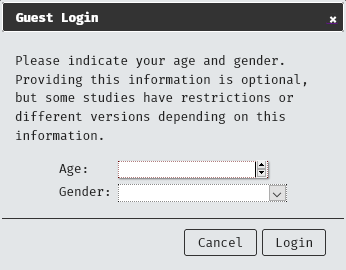
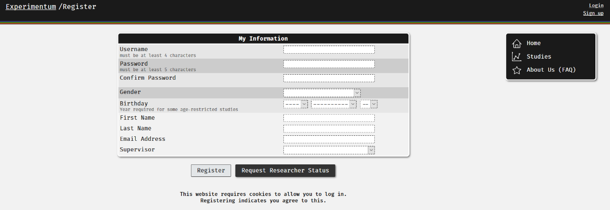
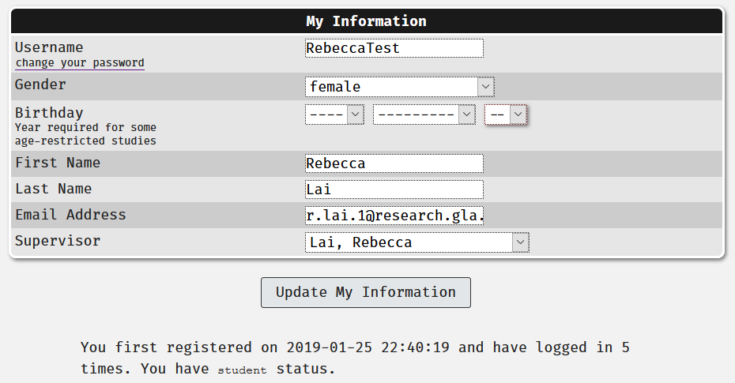
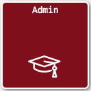
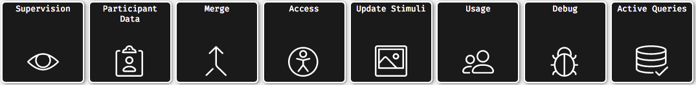
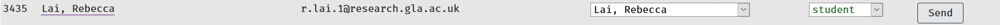

# User Accounts {#accounts}

## Overview

There are several account types that you can have with Experimentum, each with its own purpose and different levels of privileges. 

This chapter explains what account types exist, what they do, which type of account you might want to have and how to change account types for supervisors.

## Account Types {#accounttypes}

The following types of account are displayed in the downloaded data. Here is a brief explanation of the types of accounts and important informations about them.

### "Guest" Accounts

For participants who are not required to have an account. You do not need to be signed in but you can still take part in some experiments on the site. When you close your browser, this account is discarded and no longer tracked. Essentially a disposable burner account, this allows for anonymous participation.

```{block, type = "warning"}
If a guest participant closes their browser mid-way through a study their progress will not be saved and the data will read as an incomplete run.
```

As guest users do not have a profile, we do not store their age, gender or any other types of information about them. **We suggest that you do not place age or gender restrictions on studies without strong theoretical or ethical reasons to do so, especially where participants take part anonymously as guests**. When guests sign into a study they will see a dialogue box asking them for their age and gender to "replace" where stored account information usually provides it. 

<center></center>

This information is used to prevent those who should not take part from taking part and inserted into the user information in the downloaded data files. If you need to collect further demographic information, we suggest constructing a demographics questionnaire component. 

```{block, type = "bug"}
There is a known issue with the gathering of participant ages which has only been observed and reported through guest type logins, [see known issues for more information](#user_age).

To prevent irritrevable data loss should you experience this bug, it is recommended that you do not rely on this method to gather age and gender identity alone. Including a secondary age question in your demographics should give you a backup should you need it.
```

### "Registered" Accounts 

These accounts are for participants. You have created an account and given us your date of birth and gender identification. You can participate in studies on the site. Your participation record is tracked, meaning that you can be linked across multiple-part studies **should you give permission for this to be done**. 

Under no circumstances should you be linked across multiple studies without your explicit permission, we will never use data to "triangulate" your identity. Researchers can only access your data from their own studies, not the studies of other researchers. 

### "Student" Accounts

For students who are conducting research as part of a 3rd year quantitative project, undergraduate dissertation, master's or doctoral thesis. To create and run studies you must first register and then request researcher status. 

Your supervisor will be the person who changes your account status and you can check the status of your account by looking at your account info. When approved, students will be given "student" status, a special type of research account.

You may still use this account to participate in experiments, but we advise setting up a separate registered, non-research account for participation to prevent serious data submissions from being removed by other investigators.

```{block, type = "warning"}
Please do not create multiple accounts!

If you are applying for a "student" researcher account you must give your supervisor time to accept your request. This is not an automatic process. 

Creating multiple accounts will cause confusion for you, your supervisor and the admin staff.

If there is a delay in accepting your request for "student" status then you should contact your supervisor directly.

If you have an existing account that you created in 3rd year you can change to your dissertation supervisor by going to your account details and selecting a different supervisor for the drop down menu.
```

#### VPN Access

Access to the researcher areas of the site now require on campus access. This includes student accounts.

The means that you must access the site via a connection on the University of Glasgow campus, or if you are not physically on site, use the VPN to create a secure connection between your device and the university network.

You can find more information on how to use the VPN [here](https://www.gla.ac.uk/myglasgow/it/vpn/).

### "Researcher" Accounts

For staff and more senior students using Experimentum. Researcher accounts no longer appear in the list of potential supervisors for students. If you have supervision duties, choose a "supervisor" account instead.

Follow the instructions for students as above, but these users should set either Lisa DeBruine or Rebecca Lai as their supervisor, who will grant them "researcher" status. PGRs should have their supervisor confirm their autonomy with the admins before requesting this through the system to allow for speedy processing of your request.

This "supervision" is a formality to allow admins access to your account for support purposes, and not supervision in the traditional sense- for this type of support you should consult your own supervisor.

```{block, type = "info"}
Supervisors who want their more senior students to have their own "researcher" account will have to confirm this directly with the admins. 

Such requests from students on behalf of their supervisor or third party will not be granted.
```

#### VPN Access

Access to the researcher areas of the site now require on campus access. This includes researcher accounts.

The means that you must access the site via a connection on the University of Glasgow campus, or if you are not physically on site, use the VPN to create a secure connection between your device and the university network.

You can find more information on how to use the VPN [here](https://www.gla.ac.uk/myglasgow/it/vpn/).

### "Supervisor" Accounts {#super_account}

If you plan on supervising students using Experimentum you should set up a supervisor account to be able to oversee the construction of their studies, share components and change studies to "active" before data collection can begin. 

When you have established your supervisor account your name will appear in the list of potential supervisors for students to choose from.

```{block, type = "warning"} 
Supervisors should have a supervisor account if they intend for their students to use this system. **If supervisors do not engage with the system then their students will not be able to use it.**

Supervision duties in this system should not be passed to another member of staff so that you can avoid registering. Admins will not cover the duties of the supervisor. 

See the [Supervisor Cheatsheet](#roles) for a breakdown of the roles of the admins and the supervisors.
```

To get your supervisor account, you should request researcher status as indicated in the student and researcher sections above. In the supervisor list your should select either "Rebecca Admin" or "Lisa Admin". You may also wish to contact Rebecca Lai via teams message from your university account to be added to the Staff Room channel of the Experimentum Team.

#### VPN Access

Access to the researcher areas of the site now require on campus access. This includes supervisor accounts.

The means that you must access the site via a connection on the University of Glasgow campus, or if you are not physically on site, use the VPN to create a secure connection between your device and the university network.

You can find more information on how to use the VPN [here](https://www.gla.ac.uk/myglasgow/it/vpn/).

### "Test" Accounts 

For students and staff. This account type gives you the same amount of privileges as the registered account for participants, but any data collected from these accounts is saved in data sets with a status of "test". 
This allows you and other test accounts to try out your study and easily identify and filter out which data should be excluded from the analysis. If you wish to have a test account contact an admin to set this up.

```{block, type = "info"}
Where students have erroneously registered multiple times, duplicate accounts will often be changed to "test" status.
```

### "Admin" Accounts

For Experimentum support staff. This is the highest level of access.

An admin account basically allows us to "supervise" all users, including researcher accounts. We use this to see what is happening when problems arise to help provide aid, not to take responsibility for approval of status changes of students or oversee the design or activation of studies. 

This "supervision" is a formality to allow admins access to your account for support purposes, and not supervision in the traditional sense- for this type of support you should consult your own supervisor.

## Registration Process

In order to sign up to the site you will select "Sign up" on the top right-hand side of the page. Once there you will be taken to a new page as below and asked to create a username, set a password and confirm it, provide your gender identity and birthday. Completing these steps alone will create a "registered" account type. 

<center></center>
 
With this account type you can participate in studies on the site. Your participation record is tracked, meaning that you can be linked across multiple-part studies. Under no circumstances will you be linked across multiple studies without your explicit permission and we will never use data to "triangulate" your identity. Researchers and students can only access your data from their own studies, not the studies of others.

## Requesting Researcher Status

If you are a researcher or a student who is using the site to conduct a research project (such as a mini or maxi project, or an MSc or PhD thesis) you will need to request permission to construct and conduct studies. If you are a supervising member of teaching staff, you will also need to have an account in order to supervise your students project.

On the registration page, or the account page if you have already registered, there is a "Request Researcher Status" button. When you click on this additional fields will appear that you will need to fill in, as below.

<center></center>

You will need to provide us with your name, your email address and your supervisor. You should use your university email address to sign up and provide your real name so that your supervisor can more easily identify you. If you are a student conducting a research project you should select the member of staff supervising your project from the drop-down menu of supervisors. 

```{block, type = "info"}
If you are a supervising member of teaching or research staff, you should request Lisa DeBruine or Rebecca Lai as your supervisor. 

If you are a more senior student who is relatively self-sufficient or you have supervising duties of your own, *and your supervisor agrees to it*, you can also request Lisa or Rebecca as your supervisor, and we will set you as a "researcher" account type.

As a general rule, all students completing a research project should be assigned "student" status. Some PhD students may be better off with "researcher" or "supervisor" accounts (if they assist in supervising more junior students). Such individuals should speak to their supervisors and the admins to determine which is the best account type for them.

Supervisors who want their more senior students to have their own "researcher" account will have to confirm this directly with the admins. 

Such requests from students on behalf of their supervisor or third party will not be granted.
```

## Checking your account status

When you first sign up your account will be the "registered" type and will remain as such until your researcher status is approved. 
You can check on the status of your account by selecting "account" from the menu on the right-hand side of the page. Underneath the "My Information" section of the page will tell you your date of registration, number of logins and current account type.

<center></center>

The menu on the right also changes when you have been granted researcher status, with a new option of "Researchers" available which takes you to the study creation area of the site.

```{block, type = "info"}
If there is a delay in accepting your request you should contact your supervisor directly and not the admin staff. It is the responsibility of the supervisor to make changes to your access level.

If your supervisor is experiencing technical difficulties in accepting your request, they should contact the admins directly *themselves*. Admins will not respond to a student who is requesting help on behalf of their supervisor.
```

## Approving Student and Researcher Status Requests

Supervisors have a responsibility to ensure that their students have the status that they require to carry out their projects. This includes assigning them sufficient permissions to construct and deploy their studies. 

If you are a supervisor and unsure as to what type of account to give a student, refer to the [account types section](#accounttypes) above.

Once the supervisor has "supervisor" status they will have a new area of the website opened to them, accessible through the researchers' link in the menu on the right, which will contain a section called "Admin": 

<center></center>

Clicking on this button will take them to a page with more options. To see and make changes to the privileges of those who have requested you as a supervisor and requested researcher status select the option "Supervision" from the menu.

<center></center>

Here you will see a list of individuals who have requested you as a supervisor. To change their status, select the appropriate account type from the right-most drop-down menu under the column "Status".

<center></center>

The account you are making changes to will have to log out and back in again to be updated with their new permissions. When you press "Send" an email will be sent to the student to inform them of the status change.

```{block, type = "bug"}
There is a known issue with changing the statuses of research accounts regarding accounts not being found by the system, [see here](#notfound)
```

## Sona Accounts

Sona accounts are set up by the Sona administrator for the department, not by Experimentum admins. If you are unsure who the Sona administrator is, ask in the ["Experimentum" teams channel](https://teams.microsoft.com/l/team/19%3a173a62977b2445529504bc4a5128dca4%40thread.tacv2/conversations?groupId=38922d94-16b9-42ca-97a4-ee9d04a56d6a&tenantId=6e725c29-763a-4f50-81f2-2e254f0133c8).
