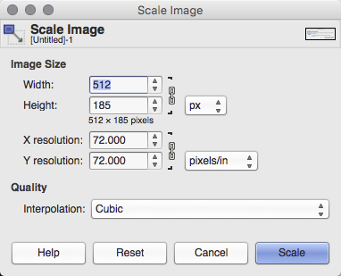
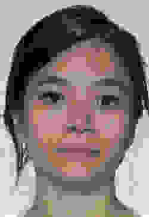

# Stimuli

## Overview

This chapter will cover how to upload your own stimuli, tips on naming conventions for the easiest possible way to assign stimuli to trials, accepted file formats and a rough guide to how to convert to the required formats.

``` {block, type = "warning"}
Remember that not all image, video and audio files are free for use. Check the license and terms of use of the images before you save, edit or copy and paste them.
```

## Accepted File Formats

Experimentum uses what we hope to be the most universally applicable file formats to deliver your study.

These are the file formats that can be successfully displayed through the site. Please ensure that you conform to these types as others may not be tolerated by the system.

```{r, echo = F}
formats <- tibble("Stimuli Type" = c("Images", "Audio", "Video"), "Accepted Formats" = c("JPEG, GIF and PNG", "MP3", "M4V"))

knitr::kable(formats)
```

## Naming Conventions

In order to make the process of assigning stimuli to trials as easy as possible it is recommended that you establish a systematic way of assigning names to files.

The stage of assigning stimuli to trials goes much faster and smoother if you can search for the stimuli files names using some sort of common text string in the names of the files.

****** more info and a working example is required.

## Pre-Processing

In order to get your stimuli up with the minimal amount of fuss, please ensure that you do any required pre-processing.

### Images

Images should be of uniform size and of the correct file formats before uploading.

#### Converting Images {-}

GNU Image Manipulation Program ["GIMP", @gimp] is a free software that allows you to modify and export image files to a variety of file formats.

<center></center>

This software was developed as a free and open source equivalent to photo-editing software such as Adobe Photoshop and can achieve very complex tasks. However, there are only 3 basic operations that you should be able to perform in GIMP order to convert your images to the correct formats. More complex operations are beyond the scope of this tutorial, but there are plenty of resources online should you choose to want to look them up.

If there are any further instructions that would prove helpful please file an issue [here](https://github.com/RebeccaJLai/exp_manual/issues) describing what you want me to include in future versions of the manual.

##### Importing Images {-}

There are a number of ways that you can import images into GIMP.

###### File > Open {-}

This is the simplest way to open an image file in GIMP.

Open the software first from your Start Menu or Launchpad. Then click on File > Open... 

***** image in here

A dialogue box will appear from which you can navigate to the location of the file you are attempting to open and select it. Click Open and the file will appear in a new tab.

***** image in here

###### "Open With" {-}

If you already have the image file saved on your PC, you can navigate to the file's location through your file explorer or finder and right click on it. Select "Open With" in the menu that pops up. This will open the GIMP GUI and should open a new tab with that image inside it. 

On some machines GIMP will not be automatically recognised as a type of software associated with image files. In this case you will need to select "Choose another app" and navigate to the executable file for GIMP (location may vary depending on machine and operating system type).

It is not advisable to permanently change all image files to be associated with GIMP, as the software can run slowly and sometimes you only want to view an image in a photo browser, not edit it.

###### Edit > Paste as... > New Image {-}

Finally, if the image file is not saved on your computer you can copy it to the clipboard and paste it directly into GIMP. Do this by going to Edit > Paste as... > New Image.

This will create a new image in GIMP that is not yet saved. I recommend saving immediately in the first instance and periodically thereafter. 

##### GIMP File Format {-}

The file extension of files created in GIMP will be `.xcf`. These types of files allow for saving of `image layers` and `text path information`, allowing you to have an image made of multiple layers and with text that can be edited at a later point.

<center></center>

```{block, type = "info"}
Saving images with layers and text path information could come in handy if you are generating your own image stimuli which features small changes (such as different words), but remains mostly the same (same background colour, size, fonts, etc).

In this case you could save a layer or export a different .GIF, .JPG or .PNG from the same .XCF file for each change that you need to make.
```

##### Changing Image Size {-}

Images that are too large can be resized in the `` html tag to fit into a smaller space but if your image is too large you could be using more memory than would be required to store your images on the server. 

This may have a knock on effect in the stimuli loading times.

Rather than consume excess bandwidth it is adviable to size the images down prior to uploading them on to the server.

To resize the image (and all layers and items contained within) click on the menu Image and press "Scale Image...". This dialoue box will come up:

<center></center>

The image size defaults to `px`, or pixels. The height and the weight are by default linked together (as demonstrated by the chain symbol to the right of the two boxes). When linked changing either the height or the width will keep the image to the same aspect ratio (the proportions of the sizes). You may unlink the aspect ratio by clicking on the chain. When unlinked the chain will appear as broken.

Linking these helps you avoid distortion that might happen if you resize one dimension only, which might elongate/shorten the other dimension and make it look funny. It also allows you to make images to fit in a specific space in your study. For example, this word completion task where images are used instead of text:

<center></center>

I have used images in the question field of a mixed questionnaire, as the blank spaces are more apparent to the participants. I have also limited their size to 25px to ensure that they do not seem too oversized in comparison to the text entry fields next to them.

##### Exporting Images {-}

GIMP is capable of exporting GIF, JPEG and PNG file formats. 

To export your image go to File > Export As. You will then be asked to enter a file name in the text box at the top of the dialogue box that opens up. 

You can specify the type of file by typing the file extension at the end of the file name, ".gif", ".jpg" or ".png" for each of the aforementioned file types respectively.

Once you have done this, press the "export" button at the bottom of the dialogue box.

You may be asked to specify compression options after pressing the button. This is just to ask how much (if any) quality you are willing to sacrifice to save on the size of the file.

This is an example from a PNG file. This image was compressed with the default options. As you can tell the quality is good, but the image is not very rich. A richer image with higher levels of variation in the pixels may do worse that this one with the same level of compression.

<center></center>

When exporting JPEG files you will be asked to select the quality as a percentage, not compression level. The higher the percentage the higher the quality and the less compression being done.

Experiment with the levels of comrpression in the image and examine the outputs carefully for any artifacts in the images resulting from the compression process. If you find the quality lacking, lower the amount of compression allowed and try again until you find the level appropriate for your images.

These images are saved as JPEG, and are at 100%, 50% and 0% quality. This gives file sizes of 76KB, 9KB and 2KB respectively:

<center></center>

The first is 100% quality, no compression. The second has minimal pixelation artifacts around the periphery of the face, neck, hair and some issues with the skin texture in places. It also seems (to my office mates and I at least) that the skin tone is a ittle yellower in image 2. Number 3 is unusable. 

### Audio

Gaby will do this bit.

### Video

## Uploading Stimuli

## Using Stimuli

### Assigning Stimuli to Experimental Trials

### Using Stimuli in Questionnaires