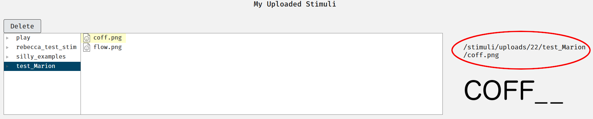

# Stimuli {#stimuli}

## Overview

This chapter will cover how to upload your own stimuli, tips on naming conventions for the easiest possible way to assign stimuli to trials, accepted file formats and a rough guide to how to convert to the required formats.

``` {block, type = "warning"}
Remember that not all image, video and audio files are free for use. Check the license and terms of use of the images before you save, edit or copy and paste them.
```

## Accepted File Formats

Experimentum uses what we hope to be the most universally applicable file formats to deliver your study.

These are the file formats that can be successfully displayed through the site. Please ensure that you conform to these types as others may not be tolerated by the system.

```{r, echo = F}
formats <- tibble("Stimuli Type" = c("Images", "Audio", "Video"), "Accepted Formats" = c("JPEG, GIF and PNG", "MP3", "M4V"))

knitr::kable(formats)
```

## Naming Conventions {#naming}

In order to make the process of assigning stimuli to trials as easy as possible it is recommended that you establish a systematic way of assigning names to files.

The stage of assigning stimuli to trials goes much faster and smoother if you can search for the stimuli files names using some sort of common text string in the names of the files.

For example, here I have 24 stimuli items. These are stylized face images of both male and female gender [@mooneys]. I have named them using the convention "mooneyxn.jpg", where x is either m or f (for male and female) and n for the number of the pair that I will present them in: 

<center></center>

This systematic naming helps in searching for your stimuli later when you come to assign them to trials. Here I can use the search box to find all stimuli containing the string "mooneyf". I can then assign them to one of two images displayed in each trial of this two alternative forced choice (2AFC) experiment below:

<center></center>

I can also search for "mooneym" and repeat the process for the other image for the male faces.

It is also beneficial to store their names in an Excel spreadsheet. Here I have stored them in pairs under column headers. I can use this later when assigning them to trials. I have also assigned trial names; this will come in handy should I need to know which trial each data point refers to in my analysis.

<center></center>

This example above is where each male face will be compared to a corresponding female face in a trial with two images. You may have more or less than two stimuli items per trial and your spreadsheet should vary accordingly.

## Pre-Processing

In order to get your stimuli up with the minimal amount of fuss, please ensure that you do any required pre-processing.

### Images

Images should be of uniform size and of the correct file formats before uploading. The following information is but one way that you can amend your files to the correct format and resolution for the site. There may be other ways to achieve the same goal. The method you choose it up to you, this is provided for those who may need some help.

If you do not resize your stimuli to the appropriate size you might find inconsistencies in the presentation of your stimuli that could act as a confounding factor in your experiments:

<center></center>

#### Creating Images {-}

You may be required to make your own image stimuli, either a modification of previously used stimuli or something completely new. This section talks about some of the basic functions of GNU Image Manipulation Program ["GIMP", @gimp], but cannot give an in depth tutorial. There are many available online as this software is fairly well used.

```{block, type = "info"}
Admin Rebecca may be able to provide limited support for **basic** GIMP functions.
```

GIMP is a free software that allows you to create images from scratch and modify and export export existing image files to a variety of file formats.

<center></center>

This software was developed as a free and open source equivalent to photo-editing software such as Adobe Photoshop and can achieve very complex tasks.

Exporting images from `.xcf` to Experimentum compatible formats is covered in the [exporting images](#gimp_export) section below- the process is the same.

##### New Image {-}

To create a new image, select `File > New...`:

<center></center>

A dialogue box will appear allowing you to set the size of the new image you are going to create. As shown, you can alter the size in many different units of measurement:

<center></center>

Once you have set and accepted these parameters you will be presented with your new, blank image:

<center></center>

```{block, type = "info"}
If you are presented with a grey checker pattern instead of a white background as presented here, then the background is transparent instead of white. 

When exporting images in some formats, like `PNG`, this transparency will be preserved in areas that you have not placed text or images.
```

##### GIMP File Format {- #gimp_format}

The file extension of files created in GIMP will be `.xcf`. These types of files allow for saving of `image layers` and `text path information`, allowing you to have an image made of multiple layers and with text that can be edited at a later point.

```{block, type = "warning"}
[Here](examples/layers demo.xcf) is an example of a `.xcf` file that I used to export multiple `.png` files from when creating the section on layers below. It uses multiple layers on the same graphic to circle the relevant discussion points, creating a standardised output. Layers with circles were duplicated and placed over the various buttons and made invisible when they were not required.
```


```{block, type = "info"}
Saving images with layers and text path information could come in handy if you are generating your own image stimuli which features small changes (such as different words), but remains mostly the same (same background colour, size, fonts, etc).

In this case you could save a layer or export a different .GIF, .JPG or .PNG from the same .XCF file for each change that you need to make.
```

##### Layers {-}

Layers allow you to create multiple layers of an image stacked on top of each other. This can be particularly handy when creating many images which need to be of a matching standard, such as text or images which differ vary slightly in a controlled way.

Layers at the top of the stack will be "on top" of the others, with their content obscuring the parts below them if the ones on top are visible. You can move layers around in the stack, or toggle the visibility of layers to change what (and how) the image looks. You can then "export" the visible parts of images to create image stimuli.

The layout of your interface may differ, but there should be either a free floating dialogue  box or "docked" dialogue open called "layers" or with a symbol of stacked layers as appears here:

<center></center>

You start with one layer, called "background".

To make changes to a layer you must have that layer selected. Select layers by clicking on them. They should become highlighted.

###### Layer Tools {-}

There are a number of useful layer tools in the layer box. Here is a short explanation of some of the more useful ones.

This button will create a new layer. The new layer will appear "on top" of the layers you already have:

<center></center>

This button will duplicate a layer that you already have. It will duplicate the current layer you have selected or are editing:

<center></center>

These buttons move the layers up and down, dictating which layers obscure which. Alternatively you can click the layer you want to move and drag it up and down the layers in the box:

<center></center>

To toggle the visibility of a layer click on the eye symbol next to the layer name. When the eye is visible, so is the layer:

<center></center>

If you want to get rid of a layer, select the layer in the layers box and press this button:

<center></center>

##### Basic Gimp Tools {-}

<center></center>

###### Select Tools {-}

Select tools allow you to select an area to work within. If selections are shown by a broken line aaround the area selected to work in. If you have an active selection you can only make changes within that area and within the layer you are working in.

The four tools differ by the shape of selection that they create. Rectangles make rectangles and circles make circles. The lasso and the wand make irregularly shaped selections, with the lasso requiring you to do it manually and the wand selecting all pixels of a certain colour (with a set tolerance) attached to where you click to automatically form the shape of selection.

To remove the selection so that you can edit other areas go to the `Select` menu and choose `None`. Here you can also `Invert` the selection- select all the other parts besides the part you choose.

The red circles in many of the images here are created using the circle selection and the fill tools. I create a new layer for the circle, use the circle selection tool to create the outer perimeter of the circle, use the fill tool to fill it with my chosen colour to create a solid circle. I then navigate to the `Select` menu at the top and press `Shrink` and in the resulting dialogue box give it a number of pixels to shrink the selection by (usually I use 4 pixels). I then press the `Delete` button on my keyboard (not the `Backspace` one) to remove the inner section of the circle.

###### Eyedropper and Cropper Tools {-}

The eyedropper allows you to select a colour from the current image. If you click on a certain pixel it will sample that colour and put it as the foreground colour in the selector at the bottom of the toolbox.

The cropper allows you to select a certain part of the image and discard all other parts by double clicking the selection you have made. This will shrink the image and the canvas size.

###### Text and Fill Tools {-}

Text tools allow you to insert text into your image. Clicking will bring up a cursor and an font selection box will pop up:

<center></center>

When you click to insert text it will be put into it's own new layer with text path information preserved- this means it is saved as text information rather than as an image. This allows you to return to edit the text as you would in a word processor. To edit the text, choose the text tool again, the correct layer and then click on the text.

To make changes to text as if it is an image you must discard the text information. This will mean that you can no-longer change this as if it were text (resizing, fixing typos, colour changes, etc):

<center></center>

###### Pencil, Brush and Eraser Tools {-}

The pencil, brush and eraser tools allow you to draw and make changes to images. You can choose different brushes and change the sizes in the brushes dialogue. They're pretty self-explanatory.

<center></center>

###### Foreground and Background Colour Selection Tools {-}

These tools allow you to change the colours. You can pick them from different displays of spectra or use CYMK (for printing), HTML notation or RGB levels (for computer display) to set specific colours. You could also use the eyedropper to select a colour from the image if you wish to reuse that. GIMP will also save a number of your previously used colours in this screen 

<center></center>

You can use the arrows next to the colour selector to swap the foreground and background colours.

<center></center>

#### Converting Pre-Existing Images {-}

However, there are only 3 basic operations that you should be able to perform in GIMP order to convert your images to the correct formats. More complex operations are beyond the scope of this tutorial, but there are plenty of resources online should you choose to want to look them up.

If there are any further instructions that would prove helpful please file an issue [here](https://github.com/RebeccaJLai/exp_manual/issues) describing what you want me to include in future versions of the manual.

###### Importing  Images {-}

There are a number of ways that you can import images into GIMP.

###### File > Open {-}

This is the simplest way to open an image file in GIMP.

Open the software first from your Start Menu or Launchpad. Then click on `File > Open... `:

<center></center>

A dialogue box will appear from which you can navigate to the location of the file you are attempting to open and select it. Click Open and the file will open.

###### "Open With" {-}

If you already have the image file saved on your PC, you can navigate to the file's location through your file explorer or finder and right click on it. Select "Open With" in the menu that pops up. This will open the GIMP GUI and should open a new tab with that image inside it. 

<center></center>

On some machines GIMP will not be automatically recognised as a type of software associated with image files. In this case you will need to select "Choose another app" and navigate to the executable file for GIMP (location may vary depending on machine and operating system type).

It is not advisable to permanently change all image files to be associated with GIMP, as the software can run slowly and sometimes you only want to view an image in a photo browser, not edit it.

###### Edit > Paste as... > New Image {-}

Finally, if the image file is not saved on your computer you can copy it to the clipboard and paste it directly into GIMP. Do this by going to `Edit > Paste as... > New Image`.

<center></center>

This will create a new image in GIMP that is not yet saved. I recommend saving immediately in the first instance and periodically thereafter. 

These will be in the GIMP file format, [`.xcf`](#gimp_format).

##### Changing Image Size {-}

Images that are too large can be resized in the `` html tag to fit into a smaller space but if your image is too large you could be using more memory than would be required to store your images on the server. 

This may have a knock on effect in the stimuli loading times.

Rather than consume excess bandwidth it is adviable to size the images down prior to uploading them on to the server.

To resize the image (and all layers and items contained within) click on the menu Image and press "Scale Image...". This dialoue box will come up:

<center></center>

The image size defaults to `px`, or pixels. The height and the weight are by default linked together (as demonstrated by the chain symbol to the right of the two boxes). When linked changing either the height or the width will keep the image to the same aspect ratio (the proportions of the sizes). You may unlink the aspect ratio by clicking on the chain. When unlinked the chain will appear as broken.

Linking these helps you avoid distortion that might happen if you resize one dimension only, which might elongate/shorten the other dimension and make it look funny. It also allows you to make images to fit in a specific space in your study. For example, this word completion task where images are used instead of text:

<center></center>

I have used images in the question field of a mixed questionnaire for a word-completion task. I created these using GIMP in order to standardise the size of the image, the text and the background of each stimuli item. It also makes the blank spaces are more apparent by using underscores. I can create a layer for each item, hide all but one and then export them one by one to create standardised images.

I have also limited their size to 25px to ensure that they do not seem too oversized in comparison to the text entry fields next to them.

#### Exporting Images {- #gimp_export}

GIMP is capable of exporting GIF, JPEG and PNG file formats. 

To export your image go to `File > Export As`. You will then be asked to enter a file name in the text box at the top of the dialogue box that opens up. 

You can specify the type of file by typing the file extension at the end of the file name, `.gif`, `.jpg` or `.png` for each of the aforementioned file types respectively.

Once you have done this, press the "export" button at the bottom of the dialogue box.

You may be asked to specify compression options after pressing the button. This is just to ask how much (if any) quality you are willing to sacrifice to save on the size of the file.

This is an example from a PNG file. This image was compressed with the default options. As you can tell the quality is good, but the image is not very rich. A richer image with higher levels of variation in the pixels may do worse that this one with the same level of compression.

<center></center>

When exporting JPEG files you will be asked to select the quality as a percentage, not compression level. The higher the percentage the higher the quality and the less compression being done.

Experiment with the levels of comrpression in the image and examine the outputs carefully for any artifacts in the images resulting from the compression process. If you find the quality lacking, lower the amount of compression allowed and try again until you find the level appropriate for your images.

These images are saved as JPEG, and are at 100%, 50% and 0% quality. This gives file sizes of 76KB, 9KB and 2KB respectively:

<center></center>

- The first is 100% quality, no compression or compression artefacts. 
- The second is 50% quality and has minimal pixelation artifacts around the periphery of the face, neck, hair and some issues with the skin texture in places. It also seems (to my office mates and I at least) that the skin tone is a little yellower in image 2, likely a result of a reduction in the available colour palette. If your experiment concerns skin tone this may be problematic.
- The third image (0% quality) is unusable for the vast majority of purposes.

```{block, type = "info"}
The level of compression that you choose will be a compromise between what the system can successfully deliver, loading times and what the level of compression does to the images that you are using.
```

### Batch Procesing Images {-}

If you have pre-existing stimuli that need to be resized or converted to another format you may want to use IrfanView (@irfanview).

<center></center>

IrfanView is a fast, compact image viewer and editor for Windows XP, Vista, 7, 8 and 10 available in 32 and 64 bit versions. 

#### Batch Conversion {-}

```{block, type = "info"}
You can resize and convert images at the same time by setting the appropriate options in one process.
```

If you need to convert images to JPG, GIF or PNG in bulk, you can do this easily.

First, ensure that all of your files are in the same folder. Open IrfanView and go to "File" > "Batch Conversion/Rename":

<center></center>

This will open the Batch conversion dialogue:

<center></center>

In the top left, ensure that batch conversion and the intended output format are selected:

<center></center>

In the top centre, use the "Look in:" part of the window to naviagte to the folder in which the images to be converted are stored. Highlight the images to be converted and press "Add", or if you are converting all the files in the folder, press "Add all":

<center></center>

The bottom box showing "Input files" should now be populated with your files. Check that the count (shown in brackets) corresponds to the number of items that you expect:

<center></center>

To the left of this select the output folder. This is where the converted image files will be placed. It is best to create a new folder to keep the types of image separate:

<center></center>

This is the file browser dialogue that you will see. Find the folder you want to store the converted files in and press "OK":

<center></center>

Click "Start Batch" to begin the conversion process:

<center></center>

You will be shown a dialogue box showing the processing. Once conversion is complete you will be shown a one line summary. you can now press "Exit batch" if you are finished:

<center></center>

Double check that your output files are correct after you have run the batch processing by navigating to them using your file system browser.

#### Batch Resize {-}

```{block, type = "info"}
You can resize and convert images at the same time by setting the appropriate options in one process.
```

If your images are the wrong size you can also resize the images in bulk too. 

Select the input files and output folder as explained above in the previous section .Access the "Bulk Conversion/Rename" dialogue again from the file menu:

<center></center>

In the dialogue, select "Use advanced options (for bulk resize)" and then press the "Advanced" button:

<center></center>

Use the "Resize" section to set a new size: 

<center></center>

Here I have reduced my images from 1024\*1024 pixels to 400\*400 pixels (as the dimensions match on each side).

Press OK to return to the previous dialogue where, if you have set the other options as indicated above, you can press the "Start Batch" button:

<center></center>

You will get the processing dialogue showing the processing and the completion message should it all go well:

<center></center>

You can use the other options to achieve other goals, but this is the simplest way to resize images.

### Audio

Since Experimentum requires auditory stimuli to be uploaded as .mp3 files, here is an easy way to convert audio files (like .wav) to mp3s using Audacity's batch-processing feature.

<center></center>

Audacity is free and open source cross-platform software which can be used to record (with suitable microphone), import, edit and export audio files in many different formats. This is also software that both the Voice Perception Lab and Face Research Lab use in their research.

Here you will find the minimal instructions that will allow you to convert your audio files to `.mp3` format in Audacity 2.1.2 [@audacity2.1.2] and Audacity 2.3.0 [@audacity2.3.0]. For the full user guide see [here](https://manual.audacityteam.org/index.html).

#### Audacity 2.1.2 {-}

If you are still on an older version of audacity, go to File > Edit Chains

<center>  </center>

There is already a chain set up for mp3 conversion, which contains 3 steps: Normalising, exporting as mp3, and an END process. 

Normalisation is a process by which you standardise the aplitude of the audio signal. If you have recorded your own stimuli you will need to normalise it first to ensure that no audio clips are excessively loud or quiet in comparison to the others. 

If you are using stimuli sourced from elsewhere it may already be normalised. In this case, highlight the first step of the chain and press delete.

<center>  </center>
 
All you should have in the chain "MP3 Conversion" is 1. ExportMP3, and 2. -END-. Click "OK" to save the chain.

<center>  </center>

Now, go to File > Apply Chain…

<center>  </center>
 
… select MP3 Conversion, and confirm with “Apply to Files...”

<center>  </center>
 
Locate the files you want to convert into mp3s from the folder on your computer, select all, and confirm with “Open”.

<center>  </center>
 
The selected files will then be converted into mp3s. You will find an additional folder called “cleaned” within the folder your original files are located in.

<center>  </center>
 
Content of the folder “cleaned”: 

<center>  </center>
 
#### Audacity 2.3.0 {-}

Audacity version 2.3.0 changed the batch-processing process, relabelling chains as "Macros". The menu for accessing the Macros got relocated to Tools > Macros…

<center>  </center>
  
The following steps are fairly similar to older versions of audacity. 

Within the macros you will find one already labelled “MP3 Conversion”. In the window “Edit Steps”, select the normalise step (Num 01) and delete it if you have already normalised the amplitude of the stimuli you are using.
 
<center>  </center>

Make sure you have only the steps “ExportMP3” and "-END-" left in your macro; then click on "Files…"

<center>  </center>
 
Locate the files you want to convert to mp3s on your computer, select/ highlight all of them, and confirm with "Open".

<center>  </center>
 
There might be a warning message popping up asking you for an input method. Select the safer or faster option according to your personality, and confirm with "OK".

<center>  </center>
 
Once the process is done, you can find the converted mp3s in a separate folder called “cleaned” that is located within the folder of your original files.  
 
<center>  </center>

Content of the folder "cleaned":

<center>  </center>

### Video

Experimentum required video stimuli to be uploaded in `.m4v` format. Here is a short tutorial based upon Reed [-@m4vconv]

These are similar to the files with `.mp4` extensions – the main difference is that `.m4v` files are Digital Rights Management (DRM) copyright protected and are mostly used by Apple. 

If you have a Windows laptop, you can manually change `.mp4` video files to `.m4v` ones without downloading additional software sometimes. 

```{block, type = "warning"}
This process will only work when the videos are not already copyrighted. Remember that not all files are free to use!

This could mean that any file you attempt to convert that has copyright protection will not run again on your computer's standard video viewer so be sure to make copies **if you have permission to use it** in case the conversion fails.
```

First go to the file where you have placed your videos. If not already showing, make sure you change the settings so that you can see the file extension. 

<center></center>

To include the file extension in the name, click on View > File name extensions and check the box or Options > Change folder and search options > View > Advanced settings and uncheck Hide extensions for known file types. You will see that it now says “videoname”.mp4

<center></center>

You can change this by simply renaming the file to “videoname”.m4v and clicking “Yes”, This should make it compatible with the Experimentum website however it may not work if the file is copyright protected. This should not be an issue if you are creating your own custom video stimuli.

<center></center>

```{block, type = "warning"}
The presentation of video stimuli is designed for short snippets, rather than longer clips.

For optimal performance keep your file sizes in the 2-3Mb range. 

If you require longer videos you may need to host the content externally (such as on YouTube) and use HTML to embed it into a questionnaire component.
```

## Uploading Stimuli {#stimupload}

```{block, type = "warning"}
Prior to uploading your stimuli, ensure that it has been pre-processed to the standard that you expect as the system will not perform automatic transformations on it for you.

For example, you should ensure that images are the correct size for presentation, audio segments should have normalised volume, the files in accepted formats etc.

You should also establish a naming convention that allows you to easily search for and assign stimuli to trials. This is covered more under ["Naming Conventions"](#naming) above.
```

To upload your stimuli, navigate to the researcher’s area of the site and select the “Stimuli” button from the menu:

<center></center>

Select “Upload” from the menu:

<center></center>

The following page is split into two sections. The upper section gives you the option to upload stimuli and the bottom section shows you what stimuli you already have uploaded. 

<center></center>

In the folder name field, enter the names of the folder you want to create. If you wish to create a subfolder type the folder name, a forward slash, then the subfolder name (*folder_name/subfolder_name*).

<center></center>

Click on the browse button and navigate to the folder where your stimuli are stored on your own storage device and select all the files you wish to upload. Click on the “open” button on the dialogue box.

<center></center>

Once you have clicked this the file names will appear in the upload section of the page. Check that these are the files that you wish to upload. Enter a description in the description box. This will help you, your supervisors and the admins should you ever require assistance.

<center></center>

Click on “Upload” to upload your files. Once you have done this the bottom of the page will change to show the name of the new folder. Clicking on the name of the new folder will open the folder and show you the files within. Clicking a file name will display the file path at the bottom right of the page:

<center></center>

Now that you have your stimuli uploaded you can put them into your experiment(s). These steps apply to all types of stimuli that can be uploaded to the site.

## Using Stimuli

### Using Stimuli Items In Questionnaires, Set and Component Introductions {#htmlstim}

You may use stimuli items uploaded to the server in questionnaire introduction sections and individual question fields by using either Markdown or HTML syntax.

```{r, eval =FALSE}
# The HTML code

  
# The Markdown code

```

The image file path can be found by navigating to Researchers > Stimuli > Uploads, selecting the folder name you gave it when you uploaded it and then the image:



The image file path is on the right hand side of the page above where the image is displayed.

For additional information on using HTML code please see this tutorial on [W3Schools](https://www.w3schools.com/html/).

### Assigning Stimuli to Experimental Trials 

Assigning stimuli to trials is a fundamental part of the process of constructing experimental components so this is covered in the section regarding experimental components [here](#assignstimexp).

### Using Stimuli in Questionnaires

You can link to stimuli in your questionnaires too. Please read the section in the [questionnaires](#assignstimquest) about using stimuli in conjuction with your questionnaires.
