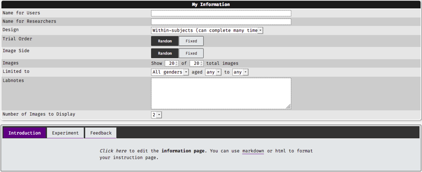
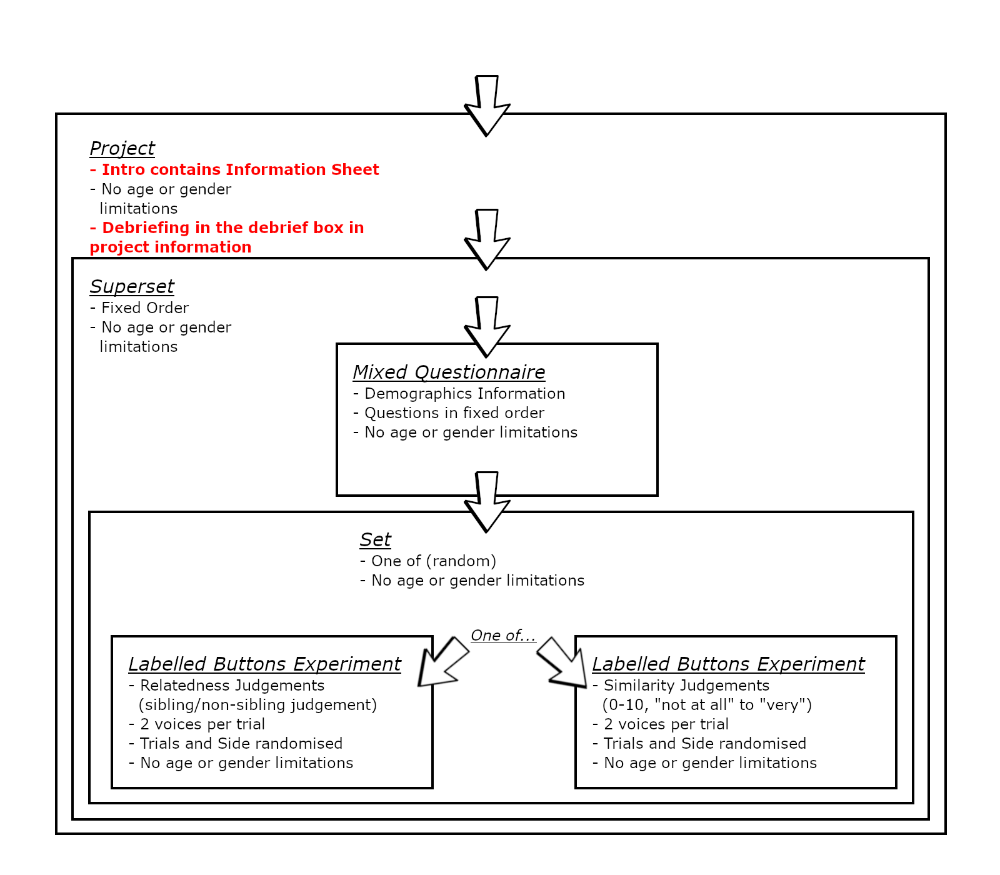
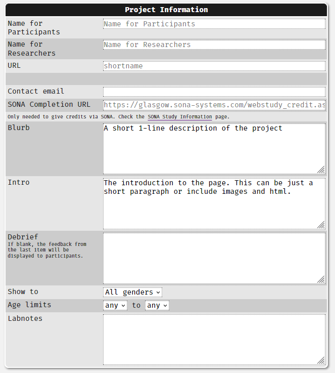
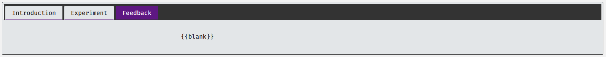

# Planning Your Project

## Overview {#planning}

Planning and constructing studies can be a rather daunting task at first, many users of Experimentum are undergraduate students embarking on their first independent research project. 

Your supervisor needs to have an Experimentum account in order to supervise what you are doing, but some will also have used the system before for their own research.

You may wish to create your account and request the appropriate account status before you are ready to start making your study. This will allow you to examine the capabilities of the system and assess if it meets your needs in good time. 

Assisting you with the design of your study is the job of your supervisor, since you will be working within their area of expertise and they will know more about what you are aiming for than the admins will. 

When you have settled on a satisfactory design you can begin planning the implementation of your study and start making it.

## Planning Your Project

Studies are made up of a series of individual components (questionnaires or experiments), which are placed into sets to help organise the order of presentation. Sets can also be placed into other sets (also known as "supersets") to further organise presentation. 

Studies with rather complex structures can be made by nesting components within sets and sets within supersets, with various ordering options available to you. When the study is constructed it must be placed into a project to allow for presentation to participants.

Projects will require you to set a custom and unique URL on the project page. When you disseminate your study, you can add certain options to the URL to allow it to be presented to participants to complete the study anonymously. See the section on Projects for more information on how this works. 

## Age/Gender Limitations

In most cases you should **not** set gender or age limitations, especially in cases where you are using [anonymous](#anon) participation. 

However, if you have a strong ethical or design decision to do so you can set these limitations, such as when you are using graphic images or strong language or have different components for males, females or non-binary participants.

You do this in the component or set information section in the "Limited to" box:

<center></center>

```{block, type = "warning"}
If you set these limitations and participants refuse age or gender information then participants will not be allowed to progress through your study.

If this information is not vital to your research this may result in loss of data that you might have otherwise been able to collect.
```

## Stimuli

First I need to establish what stimuli I am going to be using.

Am I going to create my own stimuli? Am I going to use a pre-exisiting set of stimuli items? What formats are they available in, or do I need to convert them? Do I have access to and permission to use them?

Check out the [stimuli](#stimuli) page for discussions on the required file formats and how to convert them.

How are these items typically used? This will inform the types of components that you may want to consider using.

## Individual Components {#comps}

I personally find it easiest to plan "inside-out", as it's easier for me to think about what components can do in terms of the needs of my design.

You should discuss with your supervisor wthe design of your project and what participants are going to have to do in the study you are going to be running. 

Once you have figured this out with them you should consult the questionnaire page to see which [types of questionnaire component](#quest_types) you will need to use, and/or which type of [experimental components](#exp_types) you will need to use.

You should familiarise yourself with the capabilities and limitations of the system and the components to assess if it is the right thing for you to be using. Examine the requirements of each of the components that you may need to use and how you would fill them. Look at the types of data outputs that they create and consider how you might analyse the data.

Are components available suitable for your requirements?

Let's say I am running a study where participants judge pairs of voice samples. They are going to **either** make a yes/no decision on whether the pairs of speakers are genetically related **or** judge the similarity of the voices of the speakers on an 11-point scale. **Participants will only see one condition**. I will also need to collect demographics information and consent for my participants.

As a *minimum* I will need:

1. One mixed questionnaire for demographics/consent.
2. One labelled buttons experiment for yes/no decisions (2 buttons).
3. One labelled buttons experiment for 0-10 similarity ratings (11 buttons).

<center></center>

## Sets and Supersets 

Next you need to be thinking about how to place these components into sets and supersets in order to achieve the desired flow of participants through your study. Sets tell the system how participants move through the project and must be used.

I want participants to **either** give me a yes/no relatedness judgement **or** a 0-10 similarity judgement on pairs of speakers. 

This means that I will want to group these two components together into one set and set the "type" rule to "one of (random)":

<center></center>

I also want **all** participants to complete my demographics questionnaire. This means I will need to have a superset which encompasses the set I created above and the demographics questionnaire, where items are presented in a fixed order so that the demographics questionnaire comes first:

<center></center>

Participants will enter the superset, complete the demographics/consent questionnaire and then be passed to the set containing the two labelled button experiments. They will then be asked to complete **either** the relatedness judgements **or** the similarity judgements because of the type rules I have set.

More information on "type" rules can be found in the [sets page](#type_rules). Once you have created your set you can use a [sample order](#sample_order) to simulate how participants will move through your sets.

<center></center>

Now we will go on to discuss the placement of the information sheet and the placement of the debriefing within the project.

## Information Sheet {#info_sheet}

The information sheet should normally be placed in the introduction section on the project information page (the box labelled "Intro"), as below:

<center></center>

It can be formatted with Markdown or HTML tags. If you use HTML tags, ensure that your opening and closing tags are matched to prevent data recording errors. Here is the flowchart view of where the information sheet should be placed, highlighted in red:

<center></center>

## Debriefing {#debrief}

### Debrief Formatting 
Feedback (in components and sets) and debriefing (in the project) can formatted using Markdown or HTML tags. If you use HTML tags, ensure that your opening and closing tags are matched to prevent errors. 

### Universal Debriefing {-}

Where all participants are to see the same debriefing information your debriefing should be placed in the highest possible level component. We provide them with this universal debrief by placing the debrief in the "Debrief" box of the project information page:

<center></center>

<center></center>

In this case the same debriefing will be displayed to all participants and this will suit most people's purposes perfectly well.

If this debriefing box is empty the debriefing displayed will be the text in the feedback tab of the last component completed by participants.

### Different Debriefings {-}

In the example I used above I have presented two different experimental components with two different purposes. Reminding ourselves of the example, I used:

- One labelled buttons experiment for yes/no decisions (2 buttons). Here participants will be making judgements about a pair of stimuli voice clips: are they siblings or non-siblings?
- One labelled buttons experiment for 0-10 similarity ratings (11 buttons). Here participants are judging how similar a pair of stimuli are on a scale from 0-10.

You might find that you want to present different sets of debriefing information depending on what the components the participants actually completed. 

In this case I put the different debriefing sections of each of the components or sets where the particiants branch off into different components with different tasks, explaining to participants what they did and how it relates to the wider aims of the research. This will give them the full picture of the research that they have just contributed to:

<center></center>

The feedback tab for experiments looks like this:

<center></center>

The feedback tab for questionnaires looks like this:

<center></center>

In both feedback tabs you click on the `{{blank}}` to insert your debriefing text.

### Testing Your Debrief Presentation

#### Where debriefing is in the project information: {-}

You should run through the study as a participant and test the presentation of the debrief. See [here](#participant_view) for instructions on how to do this.

#### Where debriefing is in the components or sets: {-}

Debriefing will be displayed to the participants after they have completed the component or set  depending on what feedback sections you have filled in. You can see  what feedback attached to which component will be displayed by using [sample order](#sample_order), the same way you would when testing the presentation of the components:

<center></center>

The sample order indicates that the debriefing from set 734 is the one that is going to be displayed:

<center></center>


