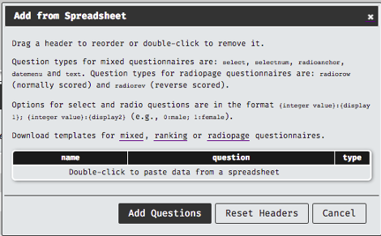
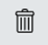
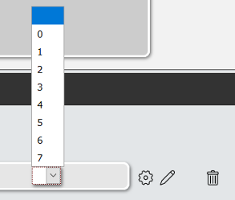

# Questionnaires

## Overview

Questionnaires are currently the most used items on Experimentum. They are made up of one or more individual components, available in 3 different types: mixed, radiopage and ranking. 

## New Questionnaire

To create a new questionnaire, navigate to the researcher’s section of the page by using the menu on the right and selecting the questionnaires option.

<center></center>
 
From here, you will be able to see the questionnaires for which you have ownership status (ones you have created yourself, or ones that someone else has shared with you). To create a new questionnaire, click the button on the top right “New Questionnaire”:

<center></center>

The following pop-up box will appear, allowing you to choose the type that you want to create:

<center></center>
 
The types that you choose will depend on what type of functionality your study requires. You should note that pencil and paper questionnaires will not always be able to be copied exactly onto Experimentum. If you make any changes to questionnaires to deliver them electronically you should discuss required changes with your supervisor to ensure their validity has not been compromised. 

## Save Questionnaire and Reset Buttons

Once you have entered information about the questionnaire you should save it. Saving regularly is good practice. Do this by pressing the save questionnaire button.

The reset button is akin to a “revert” button, where any changes made after the last save can be discarded and you return to the last saved version. 

```{block, type = "danger"}
The JavaScript for saving the questionnaire occasionally stops working on some browsers, so we recommend saving the questionnaire after every 3 or so changes to minimise loss of work in the event of an error. 

Please note that the site currently does not support version control, so once you save a change the previous version will be overwritten.
```

## Questionnaires Information

All types of questionnaires will ask you to provide information about it, the only difference will be the Questionnaire Type, which will correspond to the type of questionnaire you have chosen on the previous pop-up box.

<center></center>
 
*	**Name for Users**: this is the name of this component that will be displayed to users. Please ensure that it is appropriate.
*	**Name for Researchers**: this is the name of this component for researchers. It will be displayed on lists and visible to you, your supervisor and admin staff. It should be informative and appropriate.
*	**Question Order**: this indicates how you want Experimentum to display the questions contained **in this component only**. 
    * Fixed will display the questions to the participants in the order you have put them on this page. 
    * Random will mix the order of question presentation up automatically. Order of presentation will be recorded in your data when you download it.
*	**Limited to**: limitations will only allow people in a certain age range and with a certain gender identity to complete this component of the study. 
    * If you are planning on allowing anonymous participation you should not set limitations as age and gender identity of these users will be unknown and may not be allowed to do these sections of the study if participants refuse this information.
*	**Labnotes**: this is a short blurb about this component of your study. You should always add lab notes so that you, your supervisor and the admins will be able to tell what this component is about. 
The following sections will describe each questionnaire type and what they can do.

## Questionnaire Tab

The questionnaire tab on the lower half of the page is different for each questionnaire. Please see the appropriate sections below for more information on these.

## Feedback Tab

In most cases you should leave this empty. The feedback for the top-most set is normally where you would put your debriefing information. You can see the later sections on projects and debriefing. 

## Adding and Deleting questions

### Adding Individually

In order to add a new question, you must ensure that all editing options are closed on the existing questions by clicking the pencil to get rid of the yellow surround or the cog to close the menu.
Pressing the button at the bottom of the page will allow you to add a new question. 
 
Experimentum will add a new question by directly duplicating the previous question, with all the same text and attributes. Please ensure that you set a unique name for the new question before you attempt to save the questionnaire as questions with duplicate names will be removed by the system.

```{block, type = "danger"}
The JavaScript for saving the questionnaire occasionally stops working on some browsers, so we recommend saving the questionnaire after every 3 or so changes to minimise loss of work in the event of an error. 
```

### Adding in Bulk

It is also possible to add some types of questions in bulk by using a spreadsheet. Unfortunately, not all types are covered, but the most basic and most frequently used types are. 
Spreadsheet templates are available by clicking “add from spreadsheet” and selecting the underlined type of questionnaire from the options just above the buttons.
 
<center></center> 
 
Each of the column headers will relate to each of the question attributes you would use when setting the questions manually. For ranking and radiopage questionnaires not all of these headers will be applicable. Double click on the ones you do not need to remove them as I have done in the image below:

<center></center> 
  
Fill the template spreadsheet in and save it onto your own storage, copy the cells that contain your question information. See the section below for more about question information. 
Double click on the section that says, “Double-click to paste data from a spreadsheet” and paste it when in the new entry box that appears:
 
<center></center>  
 
If you do not use the template spreadsheet, but one you have made yourself, ensure that the options that you are specifying match. You can also drag the headers on the entry window from left to right to re-order them if your own spreadsheet does not match the headers here.

```{r, echo=FALSE, message=FALSE}

library(pander)
panderOptions("table.split.table", Inf)
panderOptions("keep.line.breaks", TRUE)
panderOptions("table.style", "grid")
panderOptions("list.style", "bullet")

q_spread <- read_csv("quest_spreadsheet.csv") %>%
  filter(type == "mixed") %>%
  select(-type)

knitr::kable(q_spread)
```


### Deleting Questions

Questions can be erased by clicking the picture of the trash/bin next to the question you want to delete.
 
<center></center>   
 
```{block, type = "danger"}
Please note that the site currently does not support version control, so once you save a change the previous version will be overwritten. This includes deleted questions- once you have saved the changes they are gone.
```

## Questionnaire Types

### Mixed Questionnaire

Allows you to present multiple question types and gather multiple response types in a single component. When you select a mixed questionnaire, you will be taken to this page:

<center></center>
 
As you can see you have the same questionnaire information section at the top, as you will have in all questionnaires. The differences lie in the types of questions that you can include. Mixed questionnaires can accommodate multiple types of questions on a single page. 

*	**Instructions**: when you click the part that says “Click here to set instructions” you will be able to enter text instructions to the participants for this entire component. You will also be able to enter Markdown and HTML code, which allows you to link to and embed additional media or format the text in specific ways. 
    * If you use HTML tags you must ensure that you have matching opening and closing tags, as unmatched ones will prevent the component from recording data.
*	**dv_name**: this is the name of the dependent variable, the name that will be assigned to the column q_name in the downloaded data indicating which question the participant has answered. You should set one which is unique to this component and perhaps across all components.
*	**Question**: clicking the part which says “click here to set your question” will allow you to enter the question text that the participants will see, the question that you want to ask them.

#### Changing Question and Response Type

Clicking the cog next to the question and then the arrow in the resulting menu will allow you to choose the type of question you want to set. 
 
<center></center> 
 
When you have selected the type of question, you can then edit the response types that can be made by the participants by clicking the pencil next to the cog. When this editing mode is active, the response section will be unfolded, and will be displayed with a yellow surround. 

<center></center> 

```{block, type = "warning"}
You must close this editing mode by clicking the pencil a second time, getting rid of the yellow surround, **before** you add a new question, click the cog or save the questionnaire.
```

In the section below I will cover the types of questions and information about the changes to the participant responses in the appropriate sections below.

*	**Pulldown Menu**: pulldown menus give your participants a set of text option responses to choose from. Each text option has a numeric coding value associated with it, which will be the returned value in the downloaded data in place of the text. This is specified before the colon. The text options are specified after the colon, these are not returned in the data. 
<center></center> 
    * Each text value should be associated with a unique numerical coding value, non-unique numerical codes will be deleted upon saving the questionnaire. You can add multiple options to the menu. 
*	**Numeric Pulldown Menu**: this allows you to set numerical values to a pulldown menu, with no associated text label. The range that is set is the range that will be displayed to the user, as below. 
    * You should use whole numbers only.
<center></center> 
<center></center> 
*	**Slider**: sliders provide you with a way for participants to return a finer-grained numerical response on a spectrum between two anchor points. A slider scale will be displayed to participants, with the low end of the range associated with the low anchor, and the high end the high anchor. Participants will move a slider along the scale, and a numerical value associated with the position they put it in returned in the data. You set the scale limits and increments, in this example from 0 to 100 in increments of 1. 
    * You can also change the text anchors by clicking on them as shown here.
<center></center> 
*	**Radio Buttons with Anchors**: this option allows you to set a scale with a low anchor and a high anchor, which you can change by clicking the text. You can add or remove points to the scale by pressing the + and – buttons on either side of the response. On this scale example below, a number will be returned associated with the point on the scale the participant submitted, here 1 (lowest) to 5 (highest).
<center></center> 
*	**Date Menu**: date menus allow the participants to choose a specific date. You can set the range of dates to choose from, in the example below the participant is allowed to go back 100 years from the current date (-100y) but cannot go further into the future than today (+0y). When participants click on the response, they will be given a calendar to pick from, instead of typing the date.
<center></center> 
<center></center> 
* **Countries**: participants can choose from a list countries. Returned in the data as the two letter ISO-3166-1 code.
<center></center> 
*	**Short Text**: allows participants to enter free-response text up to and including 255 characters. Returned in the data as character strings.
<center></center> 
*	**Long Text**: allows participants to enter free-response text over 255 characters. Returned in the data as character strings. If you do not need more than 255 characters, please use the short text to minimise strain on the server.
<center></center> 
 
