# Experimental Components

## Overview

Simple behavioural experiments can also be run through Experimentum, using a variety of different stimuli media and with a wide selection of design choices that can be combined. To create a new experiment component, navigate to the “researchers” section by using the menu on the right side of the page. 

This is an overview of the types of experimental components avaible to you:

```{r, echo = F, message = F}
knitr::kable(exps)
```

These will be covered in further detail in the section on [experimental component types](#exp_types). 

Some types require specific considerations in the interpretation of the data, assignment of stimuli, etc. Please read the one(s) that concern you carefully. 

You are also given a look at the view the participants will see in an individual trial for each type.

## Creating a New Component

Click on the “New experiment” button at the top of the page to create a new experiment, and select the type of experiment that you want to make from the dialogue box:

<center>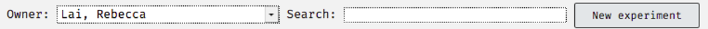</center>
<center>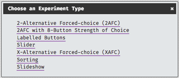</center>

This displays all of currently available experimental component types available for you to use.

### Experiment Information

All experiment types have a generic information fields in common, but some have extra depending on their functionality. Each of the options common across all types of experiment will be discussed in the following section. Where information is specific to a certain type of experiment it will be specified in brackets what type of experiment it refers to.

You should make your information section as detailed as possible to remind your future self of what you have done, but also to explain what you have done to your supervisor(s) and the admins who will use this information to provide support.
Here is an information section from a 2-AFC questionnaire for reference:

<center>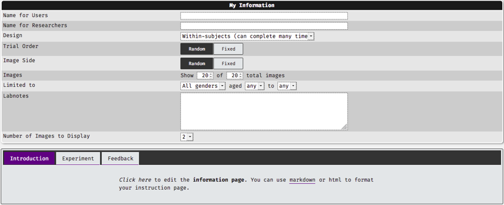</center>
 
* **Name for Users**: this is the name of this component that will be displayed to users. Please ensure that it is suitable.
* **Name for Researchers**: this is the name of this component for researchers. It will be displayed on lists and visible to you, your supervisor and admin staff. It should be informative and appropriate.

* **Design**: within or between subjects, allow for multiple completions or single completion only.
* **Slider range**: (slider only). This determines the numerical value associated with each position on the slider, and the increments along it.
 
* **Trial Order**: this indicates how you want Experimentum to display the individual trials contained in this component only. Fixed will display the trials in the order set on the “edit trials” section later. Random will mix the order of question presentation up automatically. Order of presentation will be recorded in your data when you download it.
* **Image side**: (2-AFC, 2-AFC with 8 button strength of choice only). Fixed will display images on the side specified in the “edit trials” section later. Random will switch the side of presentation randomly. Side of presentation will be recorded in your data.
* **Images**: allows you to present a subset of your stimuli to your participants. For example, if you have 40 pairs of faces from which to choose the more trustworthy, you can present a subset of 20 pairs of faces to each participant by setting this to “Show 20 of 40 total images”.
* **Limited to**: limitations will only allow people in a certain age range and with a certain gender identity to complete this component of the study. If you are planning on allowing anonymous participation you should not set limitations as age and gender identity of these users will be unknown, and they will not be allowed to do these sections of the study if they refuse to submit this information.
* **Labnotes**: this is a short blurb about this component of your study. You should always add lab notes so that you, your supervisor and the admins will be able to tell what this component is about. 
* **Number of images to display**: this specifies the number of images to display per trial. You may wish to display 1, 2 or more depending on your design.

#### Experiment info: what are these tabs?

All experiment components will present you with 3 tabs under the experiment information section. The following section discusses when the participants will see them, and make suggestions on how you may want to use these.

##### Introduction Tab {-} 

Before each component starts to run participants will be greeted with a short introduction to the component. You should include some instructions to the participants here. Here is an example from the 2 AFC type of experiment:

<center>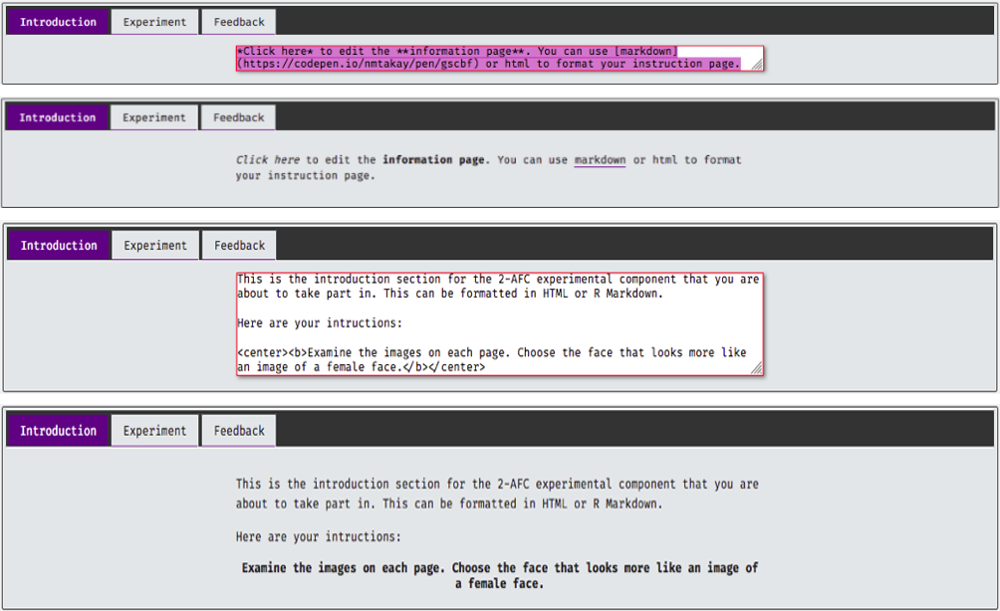</center>

The text above will appear to the participants immediately prior to the start of the first trial:

<center>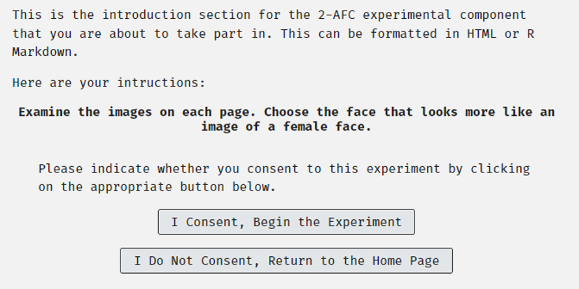</center>

This text can be formatted with HTML or Markdown code. If you use HTML tags you must ensure that you have matching opening and closing tags, as unmatched ones will prevent the component from recording data.

##### Experiment Tab {-}

Once you have written your instructions to your participants, click on the experiment tab next to introduction. Set the question here if the question is to remain the same across all trials within this component. 

<center>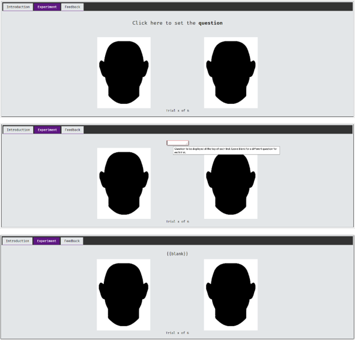</center>

If you choose to leave the question blank, delete the question and “{{blank}}” will be displayed above the stimuli images on this tab, and will be empty on each trial displayed to participants. If you wish to have the question vary by trial, you should leave the question blank. When you come to assign stimuli to trials you can type in questions according to which trial is being displayed.

If your experiment uses a scale with anchor points or text labels for buttons, you would click them to edit in the same way as the questions. Here is an example from the Slider type experiment, where there are anchors at the left and right most extremes of the scale: 

<center>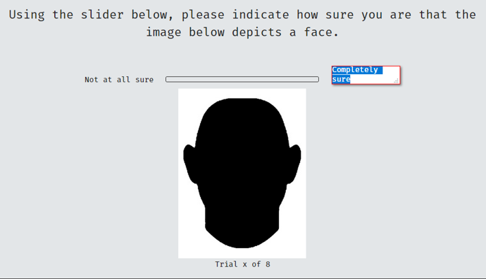</center>

An example of changing participant-facing button labels in a labelled button experiment:

<center>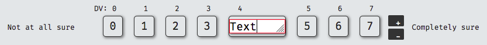</center>

Check that the number of stimuli displayed on this page are correct. Here, the "blankface" image is displayed as a placeholder for your own stimuli, regardless of the type of stimuli you are placing/have already placed. Then check that the number of trials is correct at the bottom of the page too.

##### Feedback Tab {-}

Generally, the feedback tab in individual components should be left alone. This will be covered later in the section covering Debriefing.

## Saving your Component

Saving experiments differs slightly from saving questionnaires. When you save an experiment, you will be taken to the trial editing page (see individual experiment types on how to fill in your stimuli). The reset button remains the same, it will revert to the last saved version of the experiment:

<center>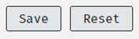</center>

## Accessing and Editing Previously Saved Experiments

To access your previously saved experiment component, navigate to the researcher’s area of the site by selecting “Researchers” from the menu on the right-hand side of the page.

You can access your experiments by accessing the experiments section of the page by using the button below:

<center>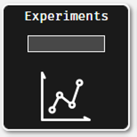</center>
 
Alternatively, if you remember the number of the experiment component, you can type it in to the grey rectangle in the experiments button. When you press return you will be taken straight to the information page of the experiment.

To edit the experiment, press the “edit” button at the top of the page and you will be taken back into the editable version:

<center>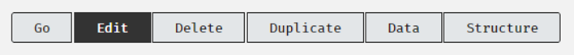</center>

```{block, type = "warning"}
If you edit and save changes to a component which is currently active you will deactivate it. 

If you are a student researcher this will mean you will need to contact your supervisor again to re-activate it.
```

## Types of Experiments {#exp_types}

There are different types of experimental components for you to choose from. They each have their own features, response types and type of DV that they return in your data. The following section will discuss each of the options available to you.

### 2-AFC (alternative forced choice) 

2-AFC experiments present participants with 2 options and ask them to make a choice between them. Here you will present 2 stimuli items together and ask participants to make a binary judgment between the two by clicking on one item only. The DV returned will be either a 1 or a 0, depending on the choice the participant makes and what stimuli item you define as a 1 or a 0 when you assign stimuli to trials (see [Notes specific to 2-AFC](#twoafc_notes) below). 

Open a new experiment by clicking the "new experiment" button on the researcher's page and select 2-AFC from the dialogue box:

<center></center>
<center></center>
 
First, you should complete the experiment information at the top of the page, then set instructions on the introduction tab. For example, I have 12 pairs of faces in my Mooney faces set that I uploaded in the [uploading stimuli](#stimupload) section, so I would change the number of total images to 12. 

Once you have finished on this page and press "Save" you will be taken to the page that allows you to assign stimuli , assign trial names and (if applicable) individual questions for the trials.

#### Notes Specific to 2-AFC {- #twoafc_notes}

When you assign stimuli to the 2-AFC be sure that you assign the correct stimuli according to the DV that you expect to be returned. 

In the screenshot below you can see that one column corresponds to a DV of 1 and the other a DV of 0. Ensure that you assign the stimuli you wish to return a DV of 1 and the stimuli you wish to return a DV of 0 to the appropriate columns.

<center>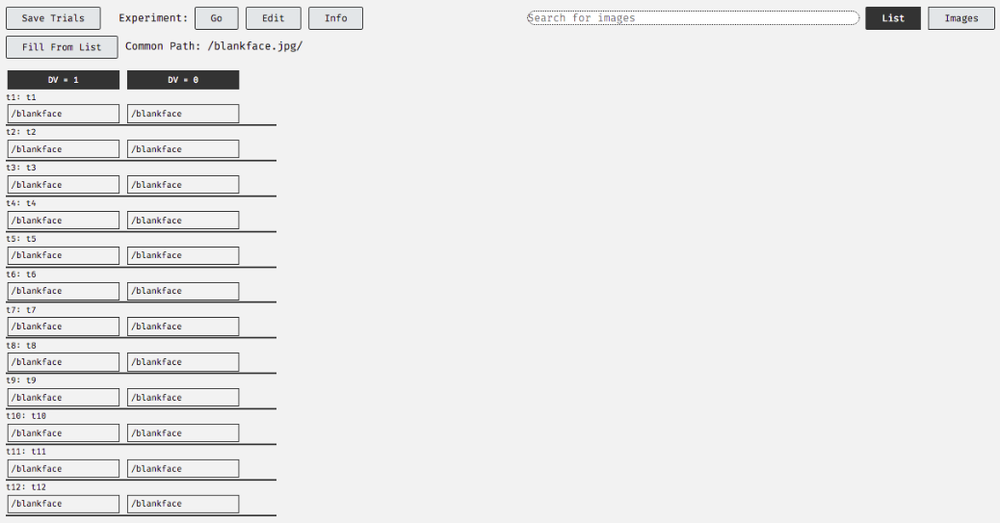</center>
 
#### Participant View {-}

When this experimental component is presented to the participants it will look like this:
 
<center>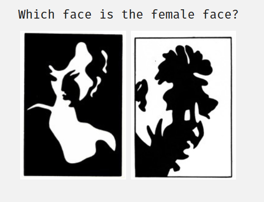</center>

### 2-AFC with 8-Button Strength of Choice (JND)

For the most part, the 2-AFC with 8 button strength of choice is largely the same as the binary 2-ACF experiment type in its presentation, but the question being asked and the DV rendered by participants differ. 

You will still be asking participants to compare the two stimuli pieces and render a judgement. Instead of asking them to pick one, you will be asking them to pick one *and* indicate the strength of their choice. This type is also referred to as the large_n JND type in the component information page.

<center>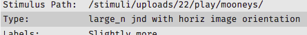</center>

Open a new experiment by clicking the "new experiment" button on the researchers' page and select 2-AFC with 8-button strength of choice from the dialogue box:

<center></center>

First, you should complete the experiment information at the top of the page, then set instructions on the introduction tab. For example, I have 12 pairs of faces in my Mooney faces set that I uploaded earlier in the uploading stimuli section, so I would change the number of total images to 12. 

Once you have finished on this page and press "Save" you will be taken to the page that allows you to assign stimuli , assign trial names and (if applicable) individual questions for the trials.

#### Notes Specific to 2-AFC with 8-Button Strength of Choice {-}

##### Assigning Stimuli {-}

As in the 2-AFC, the way that you assign stimuli matters. Stimuli assigned to the first column will return a DV from the range of 4 to 7 if chosen and those assigned to the second column will return a DV from the range of 0-3 if chosen, depending on the strength of choice indicated by participants.

<center>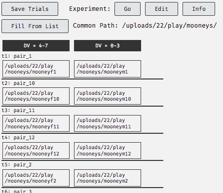</center>

##### Interpreting the Data Output {-}

What I have done here is assign the female images to return a higher range of the DV than the male images, treating the threshold between 3 and 4 to be the cut-off between judgments of male and female. In the data it looks like this:

<center>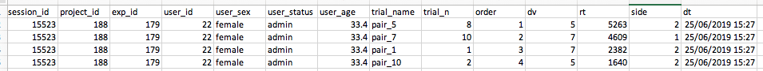</center>

You can see from the combination of my assignment of the stimuli to specific DV ranges and strength of choice indicated in the data that I perceive the females from pair_7 and pair_1 to be more feminine in appearance than females from pair_5 and pair_10.

#### Participant View {-}

The two stimuli items are displayed as below, with the buttons that participants would press being the text in the 8 boxes at the top. It looks like this:

<center>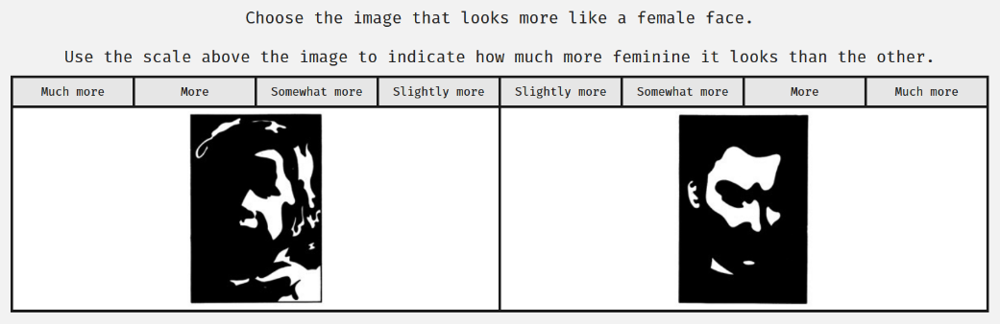</center>

Considering how I assigned my stimuli, the strength of choice buttons on the left side:

*	Much more = 7
*	More = 6
*	Somewhat more = 5
*	Slightly more = 4
	
And on the right side:

*	Slightly more = 3
*	Somewhat more = 2
*	More = 1
*	Much more = 0

### Labelled Buttons

The Labelled Buttons experiment type allows you to work with 1, 2 or 3 pieces of stimuli and participants to make a response akin to a Likert scale response. Open a new experiment by clicking the "new experiment" button on the researchers' page and select Labelled Buttons from the dialogue box:

<center></center>

First, you should complete the experiment information at the top of the page, then set instructions on the introduction tab. For example, I have 12 pairs of faces in my Mooney faces set that I uploaded earlier in the uploading stimuli section, so I would change the number of total images to 12. 
Once you have finished on this page and press "Save" you will be taken to the page that allows you to assign stimuli , assign trial names and (if applicable) individual questions for the trials.

#### Notes Specific to Labelled Buttons {-}

##### Length of the Scale, Setting Text Labels, DV values and Scale Anchors {-}

When can add or remove points along the DV scale by pressing the + or - buttons, and either delete or set high and low anchors for the scale.  

<center>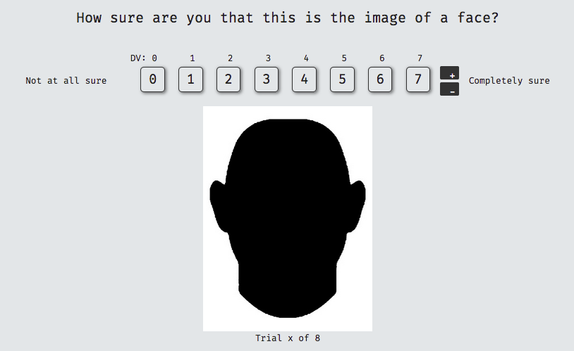</center>

As you can see, each point is associated with a numerical DV. This can also be changed by clicking on it if you wish. Each point on the scale is set as numerical by default, but you can also include text prompts.

<center></center>

The DV returned in the data is displayed above each of the labelled buttons. This can also be changed:

<center>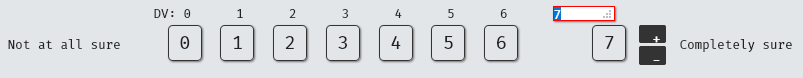</center>

##### Assigning Stimuli to Trials {-}

Assigning stimuli to trials does not impact the DV in the same way as the 2-AFC options do in that the columns do not correspond to the value returned. Notice there are no black panels with DVs or DV ranges specified above the columns:

<center>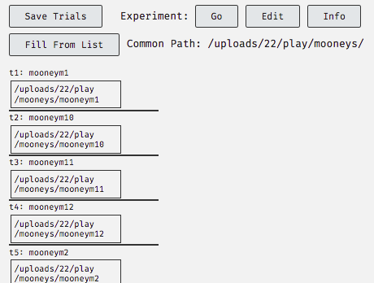</center>

The value of the DV will come from the buttons of the scale. The DV value is the one that is displayed above the scale when you are viewing the eperiment tab.

<center></center>

#### Participant View {-}

This is how a 7 labelled button scale appears to participants:

<center>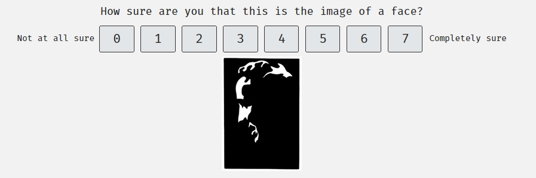</center>

### Sliders

Slider experimental components allow you to display 1, 2 or 3 pieces of stimuli and allow participants to make a response along an unlabelled slider, which returns a numerical value depending on where they place the knob of the slider. Open a new experiment by clicking the "new experiment" button on the researchers' page and select Slider from the dialogue box:

<center></center>

First, you should complete the experiment information at the top of the page, then set instructions on the introduction tab. For example, I have 12 pairs of faces in my Mooney faces set that I uploaded earlier in the uploading stimuli section. In this example I am presenting them one at a time rather than in pairs, so I change the number of images to 24. 

Sliders ranges will accept numerical values over a very wide range (tested -9999 to +9999), but you should be realistic about the values that you set. You should also change the increment to one that is suitable.

Once you have finished on this page and press "Save" you will be taken to the page that allows you to assign stimuli , assign trial names and (if applicable) individual questions for the trials.

#### Notes Specific to Sliders {-}

##### Assigning Stimuli to Trials {-}

Specific columns on the assignment screen do not carry specific DV values, as indicated by the lack of the black panels above them:

<center></center>

#### Participant View {-}

This is what the slider experiment with a single image looks like to participants:

<center>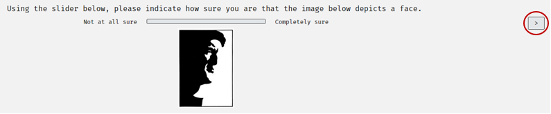</center>

The knob on the slider will only appear once the participant clicks on the scale for the first time. 

Note that the DV (the numerical value associated with the position the knob is placed in) is not displayed to participants. 

Once they have moved the knob to a position and they are happy with their decision they should press the forward arrow on the top of the right-hand side of the screen to progress to the next trial (circled above).

### X-Alternative Forced Choice (X-AFC)

The XAFC is essentially an extension of the 2-AFC experiment type, allowing you to present anywhere from 3 to 10 stimuli items to participants per trial and to pick one of the items presented. Open a new experiment by clicking the "new experiment" button on the researchers' page and select X-AFC from the dialogue box:

<center></center>

First, you should complete the experiment information at the top of the page, then set instructions on the introduction tab. Here I am presenting a subset of 6 trials using the stimuli I uploaded earlier in the uploading stimuli section. In this example I am presenting triplets of images, the Mooney faces with some photographic images from the Face Research Lab London image set (DeBruine and Jones, 2017). Participants will be asked to select the photograph.

#### Notes Specific to X-AFC {-}

##### Assigning Stimuli to Trials {-}

Despite the lack of black panels above the columns on the assignment page, the DV values do correspond to specific items of stimuli. 

If, for example, participants experiencing the first trial (first row) from the screenshot above choose option 3, the value of 3 will be presented in the data under the DV column.

#### Participant view {-}

This is what the X-AFC looks like, with 3 stimuli items displayed:

```{block, type = "warning"}
new image required
```


### Sorting

The sorting experimental component type asks participants to place items of stimuli in an order that you specify to them. This is like a rank ordering questionnaire, but it records slightly different data and allows you to use stimuli other than text. Open a new experiment by clicking the "new experiment" button on the researchers' page and select Sorting from the dialogue box:

<center></center>

First, you should complete the experiment information at the top of the page, then set instructions on the introduction tab. 

Once you have finished on this page and press "Save" you will be taken to the page that allows you to assign stimuli , assign trial names and (if applicable) individual questions for the trials. 

Here you can see that each row (representing an individual trial) will have 3 images presented. I set image side to randomisation on the information page so the presentation will not be kept in order of the columns here.

#### Notes Specific to Sorting Components {-}

##### Assigning Stimuli and DV Values {-}

For this experiment I am using Ishihara colour deficiency plate test items. These use images of numbers made up of dots in specific colours, which cannot be perceived by those who experience colour perception deficiency. This example contains numbers which the participant should sort into order.

If the participant can successfully order the numbers in a small number of changes then we should be able to assume that they can perceive the shape of the number in the circle. Those who cannot experience colour deficiency may make more mistakes in ordering the numbers. The sets used here test for deuteranopia, the most common type of colour deficiency.

As you can see, I have numbered the stimuli in a systematic way: "ishihara_x_y.jpg", where x is the number displayed in the circle and y is the set that it belongs in. By searching for "ishihara_5" I have found all images which have this string in their file name, resulting in the display of two images of the number 5 from set one and two, displayed on the right of the image below.

<center>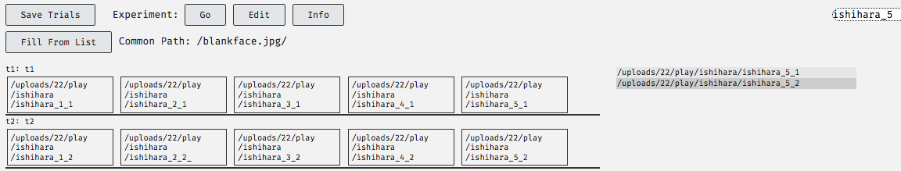</center>

As I am displaying 5 images per trial, there are 5 columns on the stimuli assignment page. By double clicking on the first box in column 5, the system inserts all of the files found into that column in the order shown in the search results.

Stimuli items set in the first column return a DV of 1, the second a DV of 2 and so on, even though there is no black block at the top of each column to specify this. This will mean that the order of assignment on this page will influence how you come to interpret your data output. This is partially why I have named my stimuli as "ishihara_x_y.jpg", where x represents the number displayed in the image. It helps me establish where to place the item in the stimuli assignment columns.

##### Interpretting Data Output {-}

The DV and side variables in the downloaded datasets for the sorting experiments are slightly different and need to be interpreted differently.

*	**session_id**: experimental session ID. Each time a participant completes the study they will be assigned a new session ID. You should discourage participants from completing more than one study at a time to ensure that the session ID remains unique to your project. Please instruct users to close their browser between studies to ensure this happens.
*	**project_id**: the number of the project that contained the component when this line of data was generated. Here it displays 0 because the component was not in a project when I tested it.
*	**exp_id**: the number assigned to the experiment by the system.
*	**user_id**: the user number. For registered users this will be a permanent assignment, for anonymous users a throwaway number will be assigned for this session only.
*	**user_sex**: user sex, as taken from either a registered user's profile or submitted in the dialogue box for anonymous users displayed at the start of each study.
*	**user_status**: the users' status. Admin, res, student or guest profile types.
*	**user_age**: user age, as taken from either a registered user's profile or submitted in the dialogue box for anonymous users displayed at the start of each study.
*	**trial_name**: name of the trial assigned by you in the stimuli assignment page, or the default of t1, t2, etc.
*	**trial_n**: the number of the trial, indicating row from the stimuli assignment page.
*	**order**: the number of the trial encountered by the user, indicating the order which the participant completed the trials.
*	**dv**: a series of numbers is provided in the sorting experiment. Taking the first data line displayed below, indicating "3:1;2;3;4;5", the 3 preceding the colon (:) indicates that the user moved the stimuli items 3 times in total to settle on the order that they did. The numbers after the colon, separated by the semi-colons (;) indicate the order that the stimuli items were placed in. In our Ishihara example, the stimuli were assigned in the order of 1,2,3,4 and 5. 
This means that on this trial the participant was able to place the stimuli in the correct order using only 3 moves.
*	**rt**: reaction time. Only serves as an indicator, as you cannot really predict the conditions of each participant's internet connection and any latency issues associated with them.
*	**side**: the original order of the stimuli displayed on the page before the participant manipulated them.
*	**dt**: date and time of the submission of this line of the data.

<center>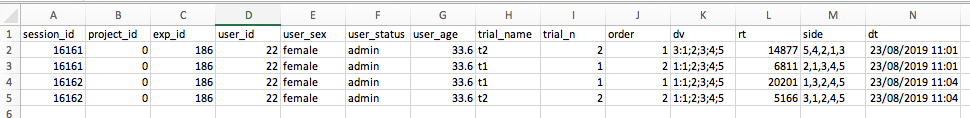</center>

#### Participant View {-}

Here is what the sorting task looks like to participants, with the top image is the initial presentation, and the second image shows one image being dragged to a different position in the presentation:

<center>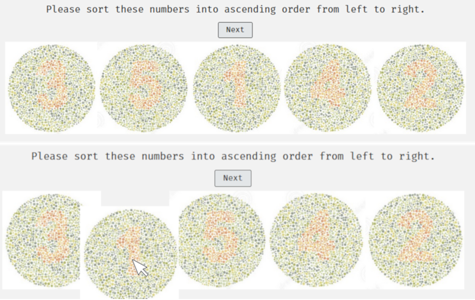</center>

### Slideshow 

Slideshows are used to display stimuli to participants in combination with other experimental components or questionnaires. They do not allow participants to make any decisions and collect no data from them. Later, you will learn about [sets](#sets) where you can combine this sort of stimuli presentation with other components.

Open a new experiment by clicking the "new experiment" button on the researcher's page and select Slideshow from the dialogue box:

<center></center>

First, you should complete the experiment information at the top of the page, then set instructions on the introduction tab. 
Once you have finished on this page and press "Save" you will be taken to the page that allows you to assign stimuli , assign trial names and (if applicable) individual questions for the trials. Here you can see that each row (representing an individual trial) will have 3 images presented.

#### Notes Specific to Slideshows {-}

##### Interpretting the Data Output {-}

The slideshow is a way to present stimuli to participants, **but it does not allow participants to provide any sort of input and as a result it does not return any DV based on a participant response**. 

You may wish to pay more attention to variables such as order and side which give you information about how the stimuli was presented. This might be useful when you combine slideshows with components which do take collect data from participants.

*	**session_id**: experimental session ID. Each time a participant completes the study they will be assigned a new session ID. You should discourage participants from completing more than one study at a time to ensure that the session ID remains unique to your project. Please instruct users to close their browser between studies to ensure this happens.
*	**project_id**: the number of the project that contained the component when this line of data was generated. Here it displays 0 because the component was not in a project when I tested it.
*	**exp_id**: the number assigned to the experiment by the system.
*	**user_id**: the user number. For registered users this will be a permanent assignment, for anonymous users a throwaway number will be assigned for this session only.
*	**user_sex**: user sex, as taken from either a registered user's profile or submitted in the dialogue box for anonymous users displayed at the start of each study.
*	**user_status**: the users' status. Admin, res, student or guest profile types.
*	**user_age**: user age, as taken from either a registered user's profile or submitted in the dialogue box for anonymous users displayed at the start of each study.
*	**trial_name**: name of the trial assigned by you in the stimuli assignment page, or the default of t1, t2, etc.
*	**trial_n**: the number of the trial, indicating row from the stimuli assignment page.
*	**order**: the number of the trial encountered by the user, indicating the order which the participant completed the trials.
*	**dv**: will all be zero on a slideshow, as there is no response recorded from the participants.
* **rt**: reaction time, in this case should be almost equivalent to the increment time that you set on the information page. It won't be a perfect match due to issues with internet connectivity.
*	**side**: the side that the stimuli was displayed on. Irrelevant in this case.
*	**dt**: date and time of the submission of this line of the data.

#### Participant View {-}

A slideshow with no questions on each trial will look like this:

<center>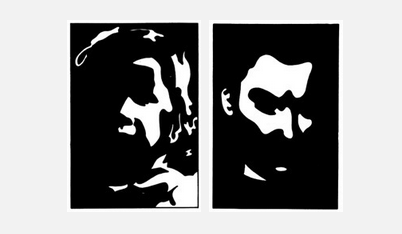</center>

Images are displayed without a question and the participant cannot make any responses, they only view the stimuli.

## Assigning Stimuli to Trials {#assignstimexp}

Once you have constructed an experiment you will assign stimuli to the trials. This is what the page to assign stimuli to trials looks like for a simple 2-AFC experiment:

