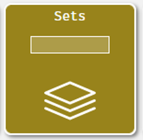
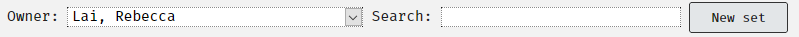
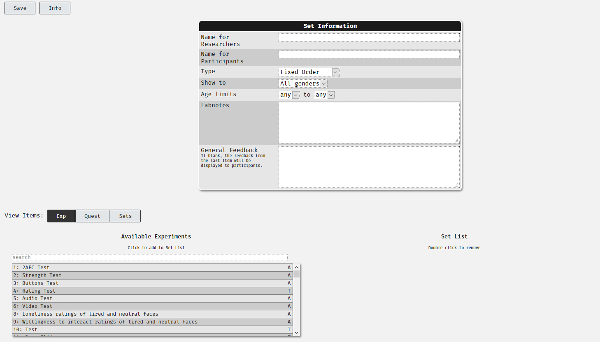
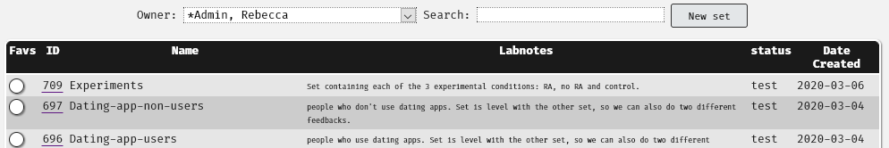
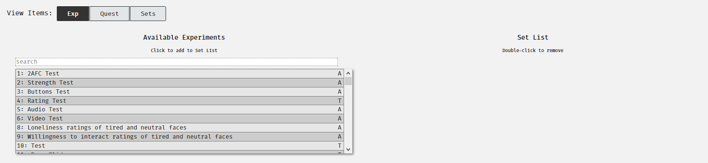
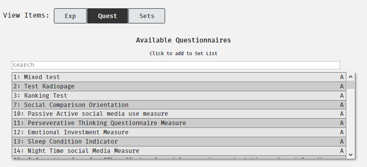
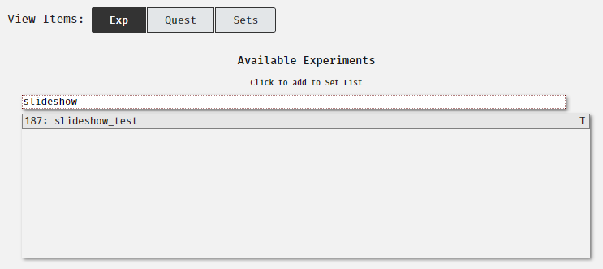
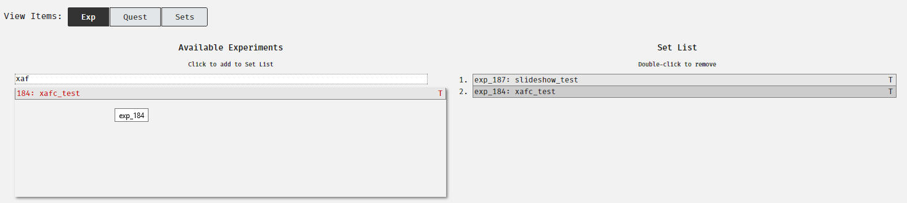
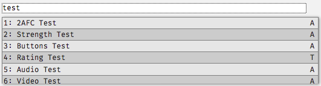
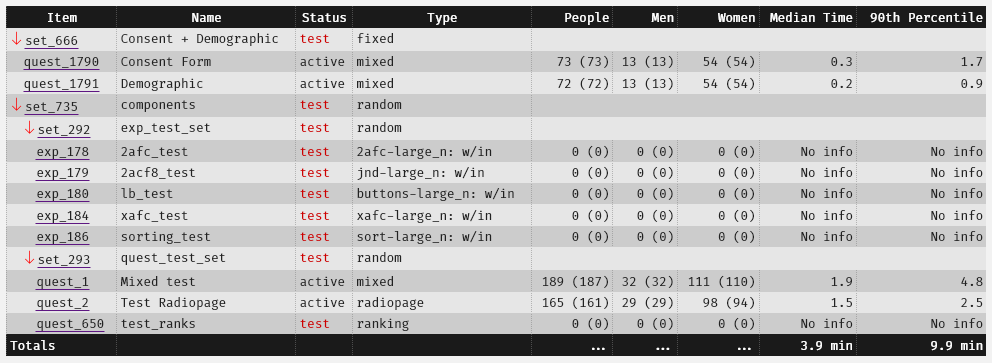

# Sets {#sets}

## Overview

Learning to use sets and supersets will be a reality for the majority of Experimentum users. Individual questionnaire or experimental components alone are not much use. 

In order to make our studies we will always need to group components together to make them work. We do this by placing them in sets, another type of component, which also allow us to make decisions on which participants see what components and the order of their presentation.

A **set** here refers to a set which contains only questionnaire and experimental components. A **superset** is a set which contains other sets nested inside of it, which may or may not also hold individual questionnaire or experimental components with those sets.

## Creating a New Set {#new_sets}

To create a set, navigate to the researcher's section of the site using the menu at the right side of the page and click on sets.

<center></center>

Next, click on the "New set" button at the top of the page to create a new set:

<center></center>

You will be brought to a page which allows you to enter information about your set:

<center></center>

This is very similar to the questionnaire and experiment information you would have completed for each of your individual components. The information requested is as follows:

* **Name for researchers**: This is the name of the set that will be displayed to the researchers. Make sure that it is informative and appropriate.
*	**Name for Participants**: This is the name of the set that will be displayed to participants. Make sure that it is informative and appropriate.
*	**Type**: This rule determines how the participants will see the items within this set only:
    *	**Fixed order**: participants will do each component of the set in the order they are placed in the set by you.
    *	**Random order**: participants will do each component of the set, but in an order randomly generated by the system.
    *	**One of (random)**: participants will do only one of the items in the set, determined randomly by the system.
*	**Show to**: gender limitations of this set. If you are allowing for anonymous participation you should not be setting gender limitations.
*	**Age limits**: Age range limitations. If you are allowing for anonymous participation you should not be setting age limitations.
*	**Labnotes**: this is a note to tell yourself, your supervisor, other researchers and the admins exactly what this set is about. Please complete this to the fullest of your ability.
*	**General feedback**: equivalent to the feedback tab in a questionnaire or experiment component. See the Debriefing section before filling in any feedback on components or sets.

```{block, type = "info"}
It may be that you construct a set for each condition of your IV and have participants randomly assigned to them. 

You should note that we are not able to guarantee **equal numbers** across each of these. You may need to monitor your study carefully and ask your supervisor or the admins to archive parts of your study to try to achieve approximately equal numbers.
```

## Saving Your Sets

When you create a set you will be asked to fill in the set information, as detailed above. When you have done this and populated the set with the components that you require click on the "Save" button on the top left of the page.

<center></center>

Just like questionnaire and experimental components, sets are assigned a number for future reference.

## Viewing and Editing Existing Sets

To view the sets that you have previously made navigate to the "Sets" area of the "Researchers" area of the website by clicking the button:

<center></center>

Here you will see the sets that you have made and can click on them to be taken to their information page. 

<center></center>

Alternatively, if you remember the number of the set, you can type the number into the box in the button to be taken directly to it. 

<center></center>

<center></center>

To edit the set, press the "Edit" button on the top left of the page.

## Adding Components to Your Set

At the bottom of the set page you will see that the page is split into two sections. On the left you have a part which shows you things you can put into your set and on the right the current contents of the set. This new set is empty.

<center></center>
 
I can use the buttons next to "View Items" on the right to show me the available experimental components, questionnaire components and other sets (more in ["Supersets: sets of sets"](#supersets)). By clicking on the appropriate button, I can switch views between the different types of components that I want to place in my set:

<center></center>

I can use the search box to either search by using the number assigned to the components I have created or search for the name for researchers that I gave them earlier:

<center></center>

I can then click on the one that I want which will place it into the current Set List on the right-hand side. I can do this with multiple items to fill the set out:

<center></center>

In the example above I might place a slideshow followed by an X-AFC experimental component to be presented in a fixed order. This might be a useful setup for testing recall of faces, where the slideshow presents a selection of visual stimuli and then participant recall is tested using an X-AFC test. 

### Component Statuses

This page also allows you to see the current status of the items you can place in your set. The A relates to items which are active, and the T denotes those which are still in test mode and cannot be viewed by participants:

<center></center>

## Supersets: Sets of Sets {#supersets}

Sometimes a single set is not enough. Sometimes you need to use a combination of different ["type" rules](#new_sets) to structure a research project to achieve your study's design. 

This will require you to create sets with your individual questionnaire or experimental components inside, but to also put these sets within other sets. 

These sets of sets are referred to as "supersets". They can also contain individual components with other sets.

Using a combination of components, sets, supersets and type rules you can come up with lots of combinations of study designs, allowing the system to meet a wide range of researcher's needs.

## Set/Superset Structure

### "Type" Rules {#type_rules}

### Participant View

You should run through your study as if you were a participant. Instructions on how to do this are in the [testing your study](#participant_view) section.

### Info Page View {#info_page_structure}

You can examine the overall set/superset structure by selecting the set you want to look at from the "Sets" menu in the Researchers section of the website and scrolling down to the bottom of the page:

<center></center>

Here you can see that the current set (734) contains other sets (set 666 and superset 735). These two sets are presented in a fixed order. Each set's own type rules are displayed under the "Type" column, which allows you to work out the order of presentation of all the components and sets within. 

It can be interpreted as follows: 

* Participants enter into set 734 and are passed into set 666, where they will complete components quest_1790 and 1791 in fixed order. 
* Participants are then passed to set 735, which contains set 292 and set 293, presented in random order. Participants will complete one and then the other in a randomised order. 
    * Both set 292 and 293 are "random", which means that the components within them are presented in a randomised order within that set.

This is a simple example, but the same principles apply to more complex designs with more components and sets.

Similar information is provided on [Project](#project_structure) information pages, which allow you to make the same deductions about the delivery of your whole project.

### Sample Order {#sample_order}

It is also advisable to use the "Test" button at the top of the page to get a "sample order" of the delivery of the project.

Pressing this button simulates how participants willmove through the set:

<center></center>

Here you can get a run down of what participants will see and in what order. I pressed the button and I can see that participants complete:

1. quest_1790 (consent form)
2. quest_1791 (demographics)
3. They are passed to set 293, where participants complete:
    1. quest_1 (mixed questionnaire test)
    2. quest_650 (rank questionnaire test)
    3. quest_2 (radiopage questionnaire test)
4. Participants are then passed to set 292, where they complete:
    1. exp 178 (2-AFC test)
    2. exp 180 (labelled buttons test)
    3. exp 179 (2-AFC with 8 button strength of choice test)
    4. exp 186 (sorting test)
    5. exp 184 (X-AFC test)
5. Finally, participants then are presented with feedback from set 734. This is our top-most set and the feedback section of this contains our debriefing information. See [Debriefing](#debrief) for more information on this part.

## Filtering Participants Using Sets 

As the system does not allow for server side calculations we normally cannot filter participants based on any scoring from questionnaires, experiments or any other sort of criteria. 

There is, however, one simple filteration you can do using sets where participants, upon immediately entering the study, will be asked to self-select into one category or another. 

See the section in [Projects](#filtering) for more information on how this is done.


