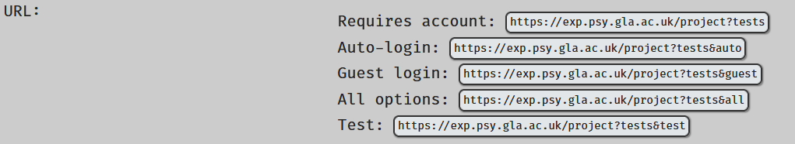

# Projects: Making your study go! {#projs}

## Overview

In order to make your study available for completion you need to be able to put the entire thing into something called a "project". This will give it a URL for you to direct potential participants to and mean that your supervisor can make it active- essentially switch it on.

## Creating a New Project

Navigate to the researcher's page using the menu on the right-hand side of the page. You will then be taken to a page where you can select "Projects":

<center></center>

After clicking "Projects" you will be taken to a page with all your currently saved projects, with the option to start a new project by pressing a button at the top of the page, as shown here:

<center></center>

After this you will be taken to the new project information page.

<center></center>

Just like any other component or set, you will need to set the information for the project. The following information is required: 

*	**Name for participants**: This is the name that will be displayed to the participants when they click on your link, but also the name that appears on the "Studies" page that registered can access. Ensure that it is informative and appropriate.
*	**Name for researchers**: this is the name that will be displayed to other researchers. Ensure that it is informative and appropriate.
*	**URL**: this allows you to set the last part of the URL (the link) that you can disseminate to potential participants. It will be automatically stuck on to the rest of the site's address and you will be given the full address below the URL box, as shown in the image below. The text you enter here should be unique from other projects on the site. You will be told if the text you have entered is available:

<center></center>

- **Contact Email**: this is the email address of the person who will be responsible for participant contact/queries. It will be displayed to participants at the end of the project. If left blank this will default to the registered email address of the researcher who created/owns the project.
- **Blurb**: this is a short description of your study that will be displayed to potential participants on the "Studies" page that registered users can access. Ensure that it is informative, appropriate and concise to prevent taking up too much space on the page.
- **Intro**: This is the information about the project. This is typically where you would place the information sheet for the study. It can be formatted with Markdown or HTML tags. If you use HTML tags, ensure that your opening and closing tags are matched to prevent data recording errors.
- **Debrief**: this is text entry form for the insertion of your debriefing text. If you leave this blank then the feedback from the next highest component will be used. This way you can have different debriefings according to what section of your study your participants have completed. See [debriefing](#debrief) for more information on what feedback panel will be displayed to participants.
- **Show to**: Gender identity-based limitations. If you are planning to use anonymous participation you should not place limitations here.
- **Age limits**: age range-based limitations. If you are planning to use anonymous participation you should not place limitations here.
- **Labnotes**: These notes inform your future self, your supervisor and admins about your study. Ensure that you fill this in and that it is informative and appropriate.

<center></center>

## Viewing and Editing Existing Projects

Navigate to the researcher's page using the menu on the right-hand side of the page. You will then be taken to a page where you can select "Projects":

<center></center>

After clicking "Projects" you will be taken to a page with all your currently saved projects. Alternatively you can click in the rectangle in the projects button and type in the project number.

## Adding Sets and Components

Just as in the sets, you will add items to your project from the project information page. Typically, you will be looking to insert sets into the project but you can add individual components if required.

You can search for what you are looking to insert by clicking the appropriate button next to "View Items" and either searching by the number assigned to that item or the "name for researchers" that you assigned it by typing in the search box.

<center></center>

Click the option from the available components list on the left-hand side to move it into your project. 

<center></center>

You can also remove items by double-clicking it in the project list on the left.

### Component Statuses {-}

This page also allows you to see the current status of the items you can place in your project. The green A relates to items which are active, and the red T denotes those which are still in test mode and unavailable to participants:

<center></center>

### Filtering Participants Using Sets {- #filtering}

```{block, type = "info"}
It is not currently possible to filter participants in studies using any sort of server-side calculations, such as a calculated score from a screening questionnaire.
```

At the moment the only filtering tool is based on placing more than one set/superset within a project and allowing participants to self-select to a category.

In most cases we would contain all components/sets within one superset and placing that set into the project. This allows for one single path for the participants to take.

In some circumstances you might want to examine the difference between two different categories of participants who need to be assigned to specific branches of a study based on their characteristics. 

For example, imagine I want to examine what people find attractive in potential partners. I want to also examine the motivations of those who are using dating apps- not all people seeking romantic partners will use dating apps!

I could create one study with all components and ask those who do not use dating apps to skip the questions that do not apply to them. 

I could also create a set for each type of user (dating app users versus non-users) with an added component asking about dating app users motivations only into the set for dating app users. I can then place two sets into the project, allowing the participants to self-select between the two branches:

<center></center>

This is what the choice will look like to the participants:

<center></center>

This is likely to be of limited use to most people running studies through the site, but the option is available for those who might find it useful.

### Icons {-}

Unlike sets, your project information page has a button labeled "Icons". You can use this to assign small icons to things in your set. Here I have searched for a clipart of a beaker, and I can drag that image tile to the set I want to assign it to:

<center></center>

After I have dragged it across the image will be assigned to that set:

<center></center>

When participants enter your study, the set will be assigned that clip art:

<center></center>

When you place your items in the project and participants navigate to it, they will see a button for each item within your project. In most cases this will only be a single button instead of the two shown here.

## Debriefs 

Debriefing information should be put in the debrief section of the project information page, but this may differ if participants who get different sets need different feedback. See the sections in [Planning Your Study](#debrief) for more information.

## Project URLs

In order for participants to access your study you will need to provide them with a URL suffix (a web link/address).

Each URL needs to be unique. For Experimentum, full URLs usually follow a set pattern (where XXXXX is a suffix that you assign to your project):

<center>**exp.psy.gla.ac.uk/project?XXXXX**</center><p>

This URL suffix is set in the project information page in the URL box:

<center></center>

```{block, type = "warning"} 
In order for your project to be accessible you should enter **only** the end part of the URL in the URL box, omitting the "exp.psy.gla.ac.uk/project?" and "&guest/auto/etc" parts. 
```

Specify the suffix in the box labeled URL. It should not contain special characters, so you can see here where I would have a space I have placed an underscore:

<center></center>

The text underneath indicates if your chosen suffix is available. 

The suffix does not need to be anything specific, but it should be appropriate for public display.

```{block, type = "info"}
This full URL will be what you share with potential participant- **exp.psy.gla.ac.uk/project?XXXXX**.

If you wish to enable anonymous participation there are further additions that need to be made. These are discussed in the section about [anonymous participation](#anon).
```

## Project Structure {#project_structure}

See the section on [planning your project](#planning) on how to plan and implement the structure of your project.

You should test the structure of your study using the methods discussed below to satisfy yourself that the presentation is exactly as you expect.

## Testing Your Study {#testingyourstudy}

Before you ask your supervisor to activate your project it is important to test it extensively. There are a number of ways that you should do this.

### Examining Structure

#### Participant View {- #participant_view}

It is important that you test your study from the viewpoint of a participant. You can do this by navigating to the project information and pressing the "Go" button at the top of the page:

<center></center>

This will run you through your study as if you were a participant. It will also generate test data which will allow you to examine the output, ensure that you can interpret the data before you run your project with real participants and allow you to remove test data easily.

```{block, type = "warning"}
You should download and retain test data before your project is activated. This will allow you to filter out the test data from the real data easily at the analysis stage.
```

It is also possible to recruit people to help you test your project- we all know that an extra pair or few pairs of eyes can more readily spot problems.

You can do this by using the **&test** URL suffix specified in the [participation](#anon) section of the page further down.

By copying the "Test" URL and sending it to testers, they will be able to access your project (including non-activated sections) for testing.

Active sections of your study will be surrounded by white, and inactive sections will be surrounded by yellow:

<center></center>

Any data that they render using a test account will be marked as test and should be excluded from your data analysis as specified in the [data](#test_data) section of this manual.

#### Info Page View {-}

As in sets you can work out the structure of the study by looking at the project info page. 

You can see how to do this in the [testing your study](#info_page_structure) section of the sets page.

#### Sample Order {-}

In sets and supersets, you can also use sample order to examine how the participants will progress through your study by examining a "sample order" of the components. 

You can see how to do this and interpret the output in the [sample order](#sample_order) section of the sets page.

#### Participants behind firewalls {-}

Some participants who are behind firewalls will not be able to access your study properly. This has historically been an issue with recruiting participants in China as Google APIs used by Experimentum are blocked.

If you wish to test participants who are behind such firewalls you will need to test that it can be accessed prior to collecting data as part of your overall testing routine.

## Activating Projects

When you create your study it will be in "test" mode. This allows you to see it, make changes and test it, but prevents participants from seeing it and doing it.

For "student" researcher accounts you will need to ask your supervisor to activate the study for you. Before you do so, please use the checklist below to ensure that you are not wasting your supervisor's time.

For researcher accounts, check and follow the guidance given in [the supervisor cheatsheet](#activating) on this topic.

```{block, type = "warning"}
Once your study is active it cannot be edited without resetting it back to "test" status, essentially deactivating it.

Students should confirm that they are completely happy with the study before they ask their supervisor to activate it. This is why the checklist below has been provided. Supervisors have been made aware of this checklist.

When a you attempt to edit an active item this warning is displayed at the top of the page next to the "Save" button:

<center></center>

If you deactivate your study in this way, even for a minor change, it is **your supervisor's responsibility to reactivate it**. 

You may wish to check that the edits made have not impacted the validity or quality of the project, or how comparable data before and after the changes are.
```

### "Is my study ready?": Student Checklist {#checlist}

Before you ask your supervisor to turn the study status to “active”, please ensure that you have done the following:

1.	Checked spelling and grammar across all components and sets and the project.
2.	Checked the stimuli presentation is correct and as expected within all components.
3.	Tested the order of presentation of components, including debrief/feedback using the test button and sample order outlined in the section [“Testing Your Study”](#testingyourstudy). 
4.	Run through your study (multiple times) as if you were a participant.
5.	Examined the test run data to ensure that you are getting exactly what you expect and that you can successfully work with and interpret it.
6.	Saved a copy of your test data so that you can later exclude it, separating the test data from the real data.

```{block, type = "info"}
Do not ask admins to activate your study. This is something that your supervisor does for you. They must be able to check the validity and quality of the study you have created before they allow you to start collecting data.
```

The process of activating studies is outlined in the supervisor page under the heading ["Activating Studies"](#activating)

## Participation Types {#anon}

### Anonymous/Registered Participation

Different types of participation require different suffixes to be attached to the URL, which you defined in the project information page:
 
<center></center> 

For your convenience, you do not need to add anything to the URL yourself, but rather return to the project information page and you will be presented with the following buttons:

<center></center> 

Clicking on one of the three buttons will copy the text to the clipboard for you to paste elsewhere.
 
The different links will lead to different types of sign in pages:

- **Requires Account (no suffix)**: participants will be required to sign in to a registered account before they can proceed to the study.
- **Auto-login (ending in "&guest")**: this will take the participant to the project first page with a button to log them in as a guest.
- **Guest login (ending in "&auto")**: this will automatically log the user in as a guest and display the dialogue box asking for age and gender identity information.
- **All options (ending in "&all")**: will display 4 buttons asking the user to choose between logging in to an existing account, registering for an account and logging in as a guest.
- **Test (ending in "&test")**: creates a test login for you to test your study. Data will be marked with status "test" so that investigators can remove this data from their analyses. Will present a dialogue box asking for age and gender identity. Pressing "cancel" in this dialogue box will return you to the project login page with the suffix "&all", displaying 4 buttons with login options as specified above.

So, this means that:

- "**exp.psy.gla.ac.uk/project&myurl**" would require participants to sign in to an existing account or be required to create an account.

- "**exp.psy.gla.ac.uk/project&myurl&guest**" would display the following button asking the users to press the button to log in as a guest. When they click this button to complete the project, they will receive a dialogue box asking for age and gender identity information.

<center></center> 
 
- "**exp.psy.gla.ac.uk/project&myurl&auto**" will bypass the “login as guest” button, instead they are automatically are logged in as a guest to complete the project and presented with the dialogue box asking for age and gender identity information.
 
<center></center>  
 
- "**exp.psy.gla.ac.uk/project&myurl&all**" will give the users the following 4 buttons where they can make the choice to login to an existing account, register for an account or login as a guest to complete the project.

<center></center> 

- "**exp.psy.gla.ac.uk/project&myurl&test**" will present the user with the test login dialogue box:

<center></center> 
 

## Participation Credits {#credits}

### Automatic Assignment of Credits
 
The School of Psychology and Neuroscience uses Sona Systems to recruit participants for research. This allows us to integrate automatic credit assignment to participants when using Experimentum.

Sona is convenient in that it frees the experimenter from excess admin and allows for greater anonymity in participation.

You can use automatic credit assignment by following these steps:

#### 1. Setup your study on Experimentum {-}

Create your study on Experimentum. This includes all [individual components](#comps), [sets](#sets) and the final project containing them as per the instructions given all over this manual. Give the project a [URL](#project-urls).

<center></center> 

Save your project and copy `&auto` URL by clicking on the button:

<center></center> 

You will need this URL to complete your Sona advert.

#### 2. Setup your advertisement on Sona and connect to Experimentum {-}

Navigate to the [Sona Systems Glasgow portal](https://glasgow.sona-systems.com/) and log in using your GUID and password. Note: this password is distinct from the ones you use for Moodle, MyCampus etc. It will have been emailed to you when you were enrolled as a researcher on Sona.

Set up your Sona advert to the specifications you require. The system is fairly self-explanatory, but if you require help you can access the support document for [Sona here](https://gla.sharepoint.com/:b:/s/SchoolofPsychologyTeaching/EcG05sVVLK5Ok9eIpxQfu50BaUFfj0ocBF21Y-csZcBxSA?e=Tld7x6) (sign in is required). For Experimentum you will be looking for an `Online External Study`.

Paste your Experimentum project URL in to the `Study URL` box of the form to ensure that Sona will send your participants to your study. Add `&credit=%SURVEY_CODE%` to the end of your URL:

<center></center> 
<br>
```{block, type = "info"}
Remember that even online studies will need to have at least one timeslot added before participants can access your study. 
```

#### 3. Link Experimentum to Sona {-}

Once your advertisement has been created on Sona, you will be able to navigate to `My Studies ` on the tab on the top of the Sona interface and click on the name of study to access the advert. Here you will find the "Completion URL".

<center></center> 

Navigate back to your Experimentum project and edit it. Copy and paste this completion URL to your Experimentum project info page in the `SONA Completion URL` box.

<center></center> 

Now, when you access the project URLS on Experimentum you will see there is a new SONA URL at the top of the page. This is what you had manually typed in the Study URL box on your Sona advert.

### Manual Assignment of Credits

It is possible to assign credits manually if there has been an error in the automatic assignment process, or in cases where automatic assignment is not possible. See the [Sona manual here](https://gla.sharepoint.com/:b:/s/SchoolofPsychologyTeaching/EcG05sVVLK5Ok9eIpxQfu50BaUFfj0ocBF21Y-csZcBxSA?e=Tld7x6) for more information. 

### Sona from the participant perspective

When participants sign in they will be able to look at all available studies. Here you will be able to browse the studies available for completion for which they meet the pre-screening criteria.

<center></center> 

Once they have clicked on the name of one of the available studies, they will be given the information page on Sona. This will include the duration and credit value that you indicated in the advert, as well as the description and advert. The URL may or may not be visible, depending on how you set up your advert (you can mask it). The name of the researcher and the administrator for the study will be displayed.

<center></center> 

Clicking on "view timeslots" will display the available timeslots. For my externally administered (on Experimentum) study, I set one timeslot which functions as a participation deadline in this case. If the participant wishes to sign up they will press the green "Sign up" button.

<center></center> 

On the next page participants are asked to confirm their intention to sign up, but also must select which course they wish to register their participation under. If you are recruiting first year psychology students who are looking to earn participation credits, ensure that they select the Psych 1a (1001) course if they have multiple courses that have participation requirements. They should then select the big green "sign up" button.

<center></center> 

The next page will confirm that they have signed up to the study. There is a "Complete survey now" button that will redirect participants to the study administered on Experimentum and additional information. After clicking this button participants will be taken to the Experimentum site where they will complete the study as normal.

<center></center> 

After participants have completed the study on Experimetnum they will be shown the debrief page. This debrief page will have a large black box at the top (above your debriefing text) with a link highlighted in red. This link is the Sona completion link and participants MUST click this to be redirected back to Sona where the credits will be assigned.

<center></center> 

After clicking this link, participants are taken back to the Glasgow Sona portal where they should recieve a message confirming that the credits have been successfully granted.

<center></center> 

If in doubt, participants can log in to their Sona account and check that they have the credits assigned to their account and the number of credits assigned under each course (for example, general participation, Psych 1A etc).

<center></center> 

