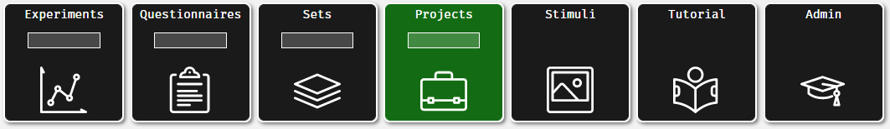
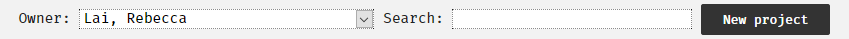
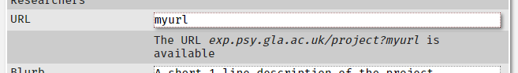
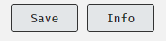
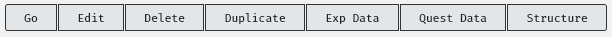

# Projects: Making your study go! {#projs}

## Overview

In order to make your study available for completion you need to be able to put the entire thing into something called a "project". This will give it a URL for you to direct potential participants to and mean that your supervisor can make it active- essentially switch it on.

## Creating a New Project

Navigate to the researcher's page using the menu on the right-hand side of the page. You will then be taken to a page where you can select "Projects":

<center></center>

After clicking "Projects" you will be taken to a page with all your currently saved projects, with the option to start a new project by pressing a button at the top of the page, as shown here:

<center></center>

After this you will be taken to the new project information page.

<center></center>

Just like any other component or set, you will need to set the information for the project. The following information is required: 

*	**Name for participants**: This is the name that will be displayed to the participants when they click on your link, but also the name that appears on the "Studies" page that registered can access. Ensure that it is informative and appropriate.
*	**Name for researchers**: this is the name that will be displayed to other researchers. Ensure that it is informative and appropriate.
*	**URL**: this allows you to set the last part of the URL (the link) that you can disseminate to potential participants. It will be automatically stuck on to the rest of the site's address and you will be given the full address below the URL box, as shown in the image below. The text you enter here should be unique from other projects on the site. You will be told if the text you have entered is available:

<center></center>

*	**Blurb**: this is a short description of your study that will be displayed to potential participants on the "Studies" page that registered users can access. Ensure that it is informative, appropriate and concise to prevent taking up too much space on the page.
*	**Intro**: This is the information about the project. This is typically where you would place the information sheet for the study. It can be formatted with Markdown or HTML tags. If you use HTML tags, ensure that your opening and closing tags are matched to prevent data recording errors.
*	**Show to**: Gender identity-based limitations. If you are planning to use anonymous participation you should not place limitations here.
*	**Age limits**: age range-based limitations. If you are planning to use anonymous participation you should not place limitations here.
*	**Labnotes**: These notes inform your future self, your supervisor and admins about your study. Ensure that you fill this in and that it is informative and appropriate.

<center></center>

## Viewing and Editing Existing Projects

## Adding Sets and Components

Just as in the sets, you will add items to your project from the project information page. Typically, you will be looking to insert sets into the project but you can add individual components if required.

You can search for what you are looking to insert by clicking the appropriate button next to "View Items" and either searching by the number assigned to that item or the "name for researchers" that you assigned it by typing in the search box.

<center></center>

Click the option from the available components list on the left-hand side to move it into your project. 

<center></center>

You can also remove items by double-clicking it in the project list on the left.

### Component Statuses {-}

This page also allows you to see the current status of the items you can place in your project. The green A relates to items which are active, and the red T denotes those which are still in test mode and unavailable to participants:

<center></center>

### Filtering Participants Using Sets {- #filtering}

```{block, type = "info"}
It is not currently possible to filter participants in studies using any sort of server-side calculations, such as a calculated score from a screening questionnaire.
```

At the moment the only filtering tool is based on placing more than one set/superset within a project and allowing participants to self-select to a category.

In most cases we would contain all components/sets within one superset and placing that set into the project. This allows for one single path for the participants to take.

In some circumstances you might want to examine the difference between two different categories of participants who need to be assigned to specific branches of a study based on their characteristics. 

For example, imagine I want to examine what people find attractive in potential partners. I want to also examine the motivations of those who are using dating apps- not all people seeking romantic partners will use dating apps!

I could create one study with all components and ask those who do not use dating apps to skip the questions that do not apply to them. 

I could also create a set for each type of user (dating app users versus non-users) with an added component asking about dating app users motivations only into the set for dating app users. I can then place two sets into the project, allowing the participants to self-select between the two branches:

<center></center>

This is what the choice will look like to the participants:

<center></center>

This is likely to be of limited use to most people running studies through the site, but the option is available for those who might find it useful.

### Icons {-}

Unlike sets, your project information page has a button labelled "Icons". You can use this to assign small icons to things in your set. Here I have searched for a clipart of a beaker, and I can drag that image tile to the set I want to assign it to:

<center></center>

After I have dragged it across the image will be assigned to that set:

<center></center>

When participants enter your study, the set will be assigned that clip art:

<center></center>

When you place your items in the project and participants navigate to it, they will see a button for each item within your project. In most cases this will only be a single button instead of the two shown here.

## Debriefs 

Debreifing information should be put in the feedback tab of the top-most set of the project. See the sections in [Planning Your Study](#debrief) for more information.

## Project URLs

In order for participants to access your study you will need to provide them with a URL suffix (a web link/address).

Each URL needs to be unique. For Experimentum, full URLs usually follow a set pattern (where XXXXX is a suffix that you assign to your project):

<center>**exp.psy.gla.ac.ukproject?XXXXX**</center><p>

This URL suffix is set in the project information page in the URL box:

<center></center>

```{block, type = "warning"} 
In order for your project to be accessible you should enter **only** the URL suffix in the URL box, omitting the "exp.psy.gla.ac.ukproject?" part. 
```

Specify the suffix in the box labelled URL. It should not contain special characters, so you can see here where I would have a space I have placed an underscore:

<center></center>

The text underneath indicates if your chosen suffix is available. 

The suffix does not need to be anything specific, but it should be appropriate for public display.

```{block, type = "info"}
This full URL will be what you share with potential participant- **exp.psy.gla.ac.ukproject?XXXXX**.

If you wish to enable anonymous participation there are further additions that need to be made. These are discussed in the section about [anonymous participation](#anon).
```

## Project Structure {#project_structure}


## Testing Your Study {#testingyourstudy}

Before you ask your supervisor to activate your project it is important to test it extensively. There are a number of ways that you should do this.

### Examining Structure

#### Participant View {- #participant_view}

It is important that you test your study from th viewpoint of a participant. You can do this by navigating to the project information and pressing the "Go" button at the top of the page:

<center></center>

This will run you through your study as if you were a participant. It will also generate test data which will allow you to examine the output, ensure that you can interpret the data before you run your project with real participants and allow you to remove test data easily.

```{block, type = "warning"}
You should download and retain test data before your project is activated. This will allow you to filter out the test data from the real data easily at the analysis stage.
```

#### Info Page View {-}

As in sets you can work out the structure of the study by looking at the project info page. 

You can see how to do this in the [testing your study](#info_page_structure) section of the sets page.

#### Sample Order {-}

As in sets, you can also use sample order to examine how the participants will progress through your study by examining a "sample order" of the components. 

You can see how to do this and interpret the output in the [sample order](#sample_order) section of the sets page.

## Activating Projects

When you create your study it will be in "test" mode. This allows you to see it, make changes and test it, but prevents participants from seeing it and doing it.

For "student" researcher accounts you will need to ask your supervisor to activate the study for you. Before you do so, please use the checklist below to ensure that you are not wasting your supervisor's time.

For researcher accounts, check and follow the guidance given in [the supervisor cheatsheet](#activating) on this topic.

```{block, type = "warning"}
Once your study is active it cannot be edited without resetting it back to "test" status, essentially deactivating it.

Students should confirm that they are completely happy with the study before they ask their supervisor to activate it. This is why the checklist above has been provided. Supervisors have been made aware of this checklist.

When a you attempt to edit an active item this warning is displayed at the top of the page next to the "Save" button:

<center></center>

If you deactivate your study in this way, even for a minor change, it is **your supervisor's responsibility to reactivate it**. 

You may wish to check that the edits made have not impacted the validity or quality of the project, or how comparable data before and after the changes are.
```

### "Is my study ready?": Student Checklist {#checlist}

Before you ask your supervisor to turn the study status to “active”, please ensure that you have done the following:

1.	Checked spelling and grammar across all components and sets and the project.
2.	Checked the stimuli presentation is correct and as expected within all components.
3.	Tested the order of presentation of components, including debrief/feedback using the test button outlined in the section [“Testing Your Study”](#testingyourstudy). 
4.	Run through your study (multiple times) as if you were a participant.
5.	Examined the test run data to ensure that you are getting exactly what you expect and that you can successfully interpret it.
6.	Saved a copy of your test data so that you can later exclude it, separating the test data from the real data.

```{block, type = "info"}
Do not ask admins to activate your study. This is something that your supervisor does for you. They must be able to check the validity and quality of the study you have created before they allow you to start collecting data.
```

The process of activating studies is outlined in the supervisor page under the heading ["Activating Studies"](#activating)

## Anonymous Participation {#anon}

To enable anonymous participation, you should take the full project URL that you will be giving to participants, as shown below in the project information page under the text entry box for URL ("exp.psy.gla.ac.uk/project?myurl"):
 
<center></center> 
 
You would then place the following suffixes onto the end of it before sending it to participants:

- **&guest**: this will take the participant to the project first page with a button to log them in as a guest.
- **&auto**: this will automatically log the user in as a guest and display the dialogue box asking for age and gender identity information.
- **&all**: will display 3 buttons asking the user to choose between logging in to an existing account, registering for an account and logging in as a guest.

```{block, type = "warning"} 
Do not put these suffixes into the URL box in the project information. It will not work.

This is something you add later to the link that you are sending participants to.
```

So, this means that:

- "**exp.psy.gla.ac.uk/project&myurl&guest**" would display the following button asking the users to press the button to log in as a guest. When they click this button to complete the project, they will receive a dialogue box asking for age and gender identity information.

<center></center> 
 
- "**exp.psy.gla.ac.uk/project&myurl&auto**" will bypass the “login as guest” button, instead they are automatically are logged in as a guest to complete the project and presented with the dialogue box asking for age and gender identity information.
 
<center></center>  
 
- "**exp.psy.gla.ac.uk/project&myurl&all**" will give the users the following 3 buttons where they can make the choice to login to an existing account, register for an account or login as a guest to complete the project.

<center></center> 
 
