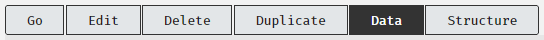
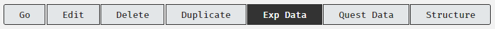
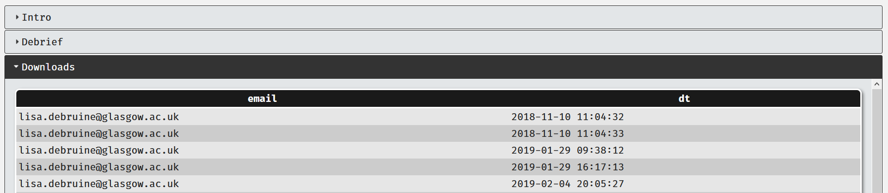
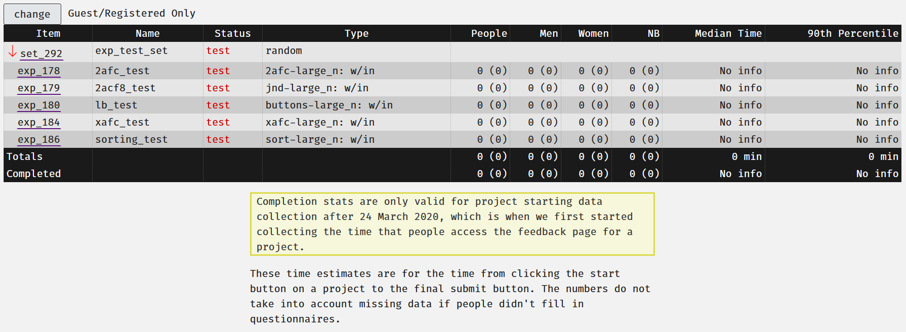

# Data

## Data Analysis Support

The admins are responsible for the smooth operation of the Experimentum site. There may be special workshops offered for students and staff who might require specialized assistance at key points in the academic year. These will be advertised on the Microsoft teams channel ["Experimentum"](https://teams.microsoft.com/l/team/19%3a173a62977b2445529504bc4a5128dca4%40thread.tacv2/conversations?groupId=38922d94-16b9-42ca-97a4-ee9d04a56d6a&tenantId=6e725c29-763a-4f50-81f2-2e254f0133c8).

Honours and PGT Students can get assistance for their R code and statistical analyses in the [Honours and PGT Stats and Data Analysis Channel](https://teams.microsoft.com/l/channel/19%3ae88503c22ad3485e83d1759b9db4d3b3%40thread.tacv2/Stats%2520and%2520Data%2520Analysis%2520Help?groupId=a3a7449f-0c8f-477b-bee2-3f9f009432cf&tenantId=6e725c29-763a-4f50-81f2-2e254f0133c8).

## Researcher Access

Access to the researcher areas of the site now require on campus access. Many of the functions of the site detailed here are within the researcher areas of the site.

The means that you must access the site via a connection on the University of Glasgow campus, or if you are not physically on site, use the VPN to create a secure connection between your device and the university network.

You can find more information on how to use the VPN [here](https://www.gla.ac.uk/myglasgow/it/vpn/).

## Data Formats

Data is downloaded in .CSV files in long format. This means that each line represents a single trial or question.

```{block, type = "warning"}
It is important to test each component of your project and generate test data to ensure that the data produced are what you expect and that you know how to interpret it. See the section on [testing your project](#testingyourstudy) for more information.
```

### Data Outputs

Each experiment and questionnaire type has information on how to interpret the data output in the [experimental component types](#exp_types) and [questionnaire types](#quest_types) sections.

Read the parts appropriate to the types of components and questions that you are using in your study.

## Downloading Your Data

### From Individual Components

Navigate to each of the components and download the data for each individually. This will download multiple CSV files, one for each component.

<center></center>

### From the Entire Project

Navigate to the project page and click on the “Exp Data” and “Quest Data” buttons. This will download the data from all the experimental components or questionnaire components respectively in one large CSV file:

<center></center><p>

```{block, type = "bug"}
In some cases, the project CSV files downloaded using the project page can appear to be "missing" some lines of data.

This is usually as a result of participants completing multiple studies at the same time. If you experience this, try downloading from individual components. 

You can combine the CSV files into a single data frame in R when you come to run your analysis if you need to.
```

### Download Logs

Data downloads are now logged. The email address of the user who downloaded the data is displayed under the "Downloads" tab in the project information page and within each questionnaire and experimental component. 

<center></center><p>

This allows for a transparent data audit trail.

## Test Data {#test_data}

Before your study goes active you should have performed extensive testing of your study. This will have left test data in your project that you will need to remove from your data from real participant’s data. 

```{block, type = "warning"}
It is recommended that you download your test data before you ask your supervisor to make your study active. These files will allow you to exclude the test data in R before you conduct your final analysis.
```

## Number of Participants

The sets, supersets and projects display some information on their pages that might give you an impression of the number of participants that you have had run through them, as shown in the tables in the sets and supersets structure.
 
**This is an approximation and should not be taken as the definitive number of participants, as there may be issues in your data that might exclude some participants.**

<center></center>

We have had previous system users misinterpret the meanings of some of the items in this table. Here is what they mean:

- People: the number of completions of the item shown in that row. The number in brackets shows the number of unique users who has completed it. In this case, exp_178 I have one participant who has completed it 7 times (this was me testing it).
    - Note: “people” includes participants who identify as male, female, non-binary AND anonymous users who have chosen not to disclose their gender identity.
- Men: this is the number of people who identify as men who have completed the component. Again, unique participants will be shown in brackets.
- Women: this is the number of people who identify as women who have completed this component. Again, unique participants will be shown in brackets.
- NB: this is the number of people who identify as non-binary. As before, unique participants are shown in brackets.
- Median Time: The median time taken for all participants who have run through this component to complete this part.
- 90th percentile: The 90th percentile time to completion.

The button at the top labeled "Guest/Registered Only" allows you to toggle the numbers for those who completed the project as guests/registered and "all".

The totals row is a **sum** of all of the numbers in each of the columns. As you can see the total for the “people” row shows 18 completions by 5 unique participants, but I have been the only person to complete the study through my testing. The same goes for the men’s and women’s row. The totals do not reflect the true number of participants.

```{block, type = "warning"}
Completion stats are only valid for project starting data collection after 24 March 2020, which is when we first started collecting the time that people access the feedback page for a project.

These time estimates are for the time from clicking the start button on a project to the final submit button. The numbers do not take into account missing data if people didn't fill in questionnaires.

Sessions previous to this date have an end time equal to the last completed question or experimental trial, even if the user did not complete the entire project.
```

## Help with Data

Aside from issues arising from Experimentum, you should consult your supervisor and the appropriate R Support for assistance in processing and analyzing your data.

```{block, type = "bug"}
There is a known issue with question names being saved with a `/n` in the cell. See [known issues](#knownissues) for an explanation and solution.
```

### Commonly Used Code {#commoncode}

#### First completion only {-}

If you want to get the first completion of each participant **only**.

Not for use where participants will complete the same study or component repeatedly.

Retain only real participant data, removing researcher, student, admin, supervisor and test account data (if these runs are not legitimate data).


```{r, eval = F}
# load your raw data
dat_raw <- read_csv("experimentum_data.csv")

dat_first_answer <- dat_raw %>%
  group_by(user_id, q_id) %>%
  filter(session_id == min(session_id), endtime == min(endtime)) %>%
  filter(row_number() == 1) %>%
  ungroup() %>%
  filter(user_status %in% c("guest", "registered"))

```
