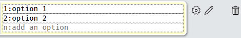

# FAQs {- #faqs}

## Overview {-}

The most commonly asked questions, documented here so that you can review the potential solutions.

Potential workaround for common bugs awaiting a fix are documented in the [Known Issues](#knownissues) chapter.

## About Support {-}

### I emailed an admin and haven’t received a response {-}

In addition to helping you with Experimentum we also have our own research and teaching responsibilities. As a result, our inboxes are usually very full, and emails will inevitably be missed. All students and staff should use the appropriate [Microsoft Team Experimentum channel](@support) if they have support issues as this is the most reliable method of contact.

## About Accounts {-}

### I have requested researcher status and haven’t received it {-}

Your supervisor is the person responsible for upgrading your account with the appropriate permissions.

Admins are not responsible for tracking who is entitled to what access levels. 

If your supervisor is experiencing technical difficulties in changing your status it is their responsibility to report these issues to the admins, not yours. No third party request on behalf of a supervisor to change access levels will be accepted by admins.

Members of teaching staff who are supervising students and experiencing delay in receiving appropriate permissions should contact Professor DeBruine or Rebecca as a matter of urgency via direct message on [Microsoft Team Experimentum channel](@support).

Researcher status will not be granted to students, researchers or members of the public who do not have an official role at the University of Glasgow School of Psychology.

### My supervisor approved my researcher status, but my account doesn’t have updated privileges {-}

If you are logged in when your supervisor makes these changes you will need to log out and back in again for your privileges to be updated correctly. If this does not resolve the issue contact the admins for support.

### I have lost my password {-}

Automatic password resetting has now been added to the site. See the guidance at [Lost Passwords](#lost_password) to reset yours.

If this is not an option, supervisors and researchers may also issue temporary passwords to their students and participants but should ensure that they take all necessary measures to verify their identity and right to access the account. 

This could be through the production of student or other photographic ID. If their identity cannot be verified the password should not be reset and instead they should be asked to register for a new account.

All temporary passwords should be changed as soon as possible through the Account options on Experimentum.

## About Study Construction/Activation {-}

### My questionnaire/responses to questions won’t save {-}

Occassionally the Javascript that allows us to save questionnaires stops working.

We have yet to determine a pattern or cause for this.

Please save your questionnaires *frequently* to prevent any substantial loss of work (recommended to save every 3 questions added) or to consider using [bulk upload of questions](#addfromspreadsheet). You should save your questionnaires regularly to ensure that if this happens you won’t lose too much work. I recommend saving after every 2-3 questions.

Codes assigned to response variables (the number before the colon in the image below) should be unique within that question, otherwise they will overwrite each other, and duplicate options will be removed.

Editing options for responses to questions must be closed before you attempt to save the questionnaire by re-clicking the pencil icon next to the cog. You can tell that editing is open by the yellow colour surrounding the response options as below.

<center></center>
 
### Can the system make studies which branch depending on the responses given by participants? {-}

This is currently an **extremely limited** option. 

It is possible to allow participants to self-select to a set by placing multiple supersets within a project rather than one superset as you normally would. Participants will then complete the set that they have selected:

<center></center>
 
```{block, type = "infor"}
We cannot do server-side calculations to filter participants to specific components based upon their responses to questionnaires or experiments.
```

### I edited my study and it changed from active to test. How do I change it back? {-}

Supervisors are responsible for making sure that your student project is suitably constructed and are the only ones who can authorise you to start collecting data.

When you make any change to your study, Experimentum will change the status back to test automatically. Changes must be approved by your supervisor to ensure they have not invalidated your study. When they are satisfied that your study meets the standard that they expect, and that the changes are appropriate, they can change the study back to active for you. 

You should be aware that changes to your study may render the data collected prior to the changes incomparable with data collected after. Changes should not be made after projects have been set to active unless a) the changes are minimal (for example, correcting a typo) or b) where you are willing to accept the possibility that your data prior to/after the change could potentially be invalidated.

It is not the job of the admins to approve changes to your study, as we are not likely to have adequate knowledge of your specialisation to assess it meets the appropriate standard. If your supervisor experiences technical issues in doing this then they must contact admins via the appropriate [Microsoft Team Experimentum channel](@support).

### My study/components of my study are set to test. How do I make it active? {-}

Your supervisor is the person responsible for making this change from test to active when they are satisfied that it meets the standard that they expect. 

As we do not have expertise in your specialisation, we cannot assess that it meets the appropriate standard. If your supervisor is experiencing technical issues in attempting to do this it is their responsibility to contact the admins, not yours.

### Where do I put my information/debrief sheet? {-}

Your information sheet should usually be entered on the introduction section of the project page. The debrief sheet, likewise, should usually be entered into the feedback section of the top-most set within the project. 

<center></center>

In certain circumstances it might be put elsewhere, such as when your participants complete different study components. If you do not know where to put your debrief, seek support.

### Can I have multiple response scales on a single radiopage questionnaire? {-}

Unfortunately, this cannot currently be done. Consider making a radio page per scale and combining them into a set.

This is most commonly asked in relation to the next question, “Does my Experimentum questionnaire need to look exactly like the paper version?”.

### Does my Experimentum questionnaire need to look exactly like the paper version? {-}

Not always. Paper questionnaires were limited by issues like available printing resources and ease of data input. With electronic delivery this is no longer a concern, and the system can delivery added utility such as question randomisation.

If you are concerned that changing the presentation of the instrument you are using has impacted its validity you should discuss these concerns with your supervisors.

## About Study Participation {-}

### Can participants skip questions? {-}

Yes, on questionnaires participants can skip questions they do not want to answer.

If participants choose not to submit data to specific parts they should be informed to continue through the study and leave questions blank. They will then be prompted to ensure that this is their intention:

<center></center>

The questions that are incomplete will be highlighted yellow when this prompt is displayed, allowing participants to see what they have left out before they progress.

Participants canno skip trials in experimental components. They can discontinue the study by closing their browser.

### My participants are not being allowed to take part in my study/a part of my study {-}

This usually happens when you allow anonymous participation but have chosen to set limitations on gender identity and age range on a component, set or project. 

Anonymous users ages and genders are not known, thus their eligibility to take part on studies with limitations is not able to be assessed. It used to be that the system would pass the participants directly past the parts of the study with limitations.

As a way to combat this, participants of anonymous studies will now see a dialogue box asking for their age and gender identity. If the participants fill in this information and they meet the requirements they will see your study as normal. If they refuse this information they will still bypass the parts of the study with limitations as we cannot tell if they are eligible to participate.

If you wish to gather information from participants then you must always respect their right not to answer all of your questions, including their age and gender identity. If this information is refused, then they may not be able to take part in your study. 

We recommend that if you do not have a strong theoretical or ethical reason to limit participation by these characteristics then you do not place limitations on any part of your study.

## About Data {-}

### Missing Data {-}

A number of system users have reported "missing data", however the data was later found to be misattributed to a different project. **Truly missing data is rare**. 

Data can be misattributed to a different study if participants are completing more than one study at the same time. Therefore, we recommend that you download your data from each of the individual components from your study rather than downloading the data from the entire project page- see [“Downloading Your Data”](#data). 

All data recorded under the individual components will be contained in the CSV file, regardless of what project it has been attributed to.

```{block, type = "info"}
You should also bear in mind that online studies are particularly prone to attrition, especially if they are longer in duration, repetitive or require high effort levels from participants. 

If you have concerns about missing data and have tried examining the data from individual components as above without success, contact the admins for support.
```

### Where is my data stored? {-}

Your data is stored on site at the University of Glasgow School of Psychology.


