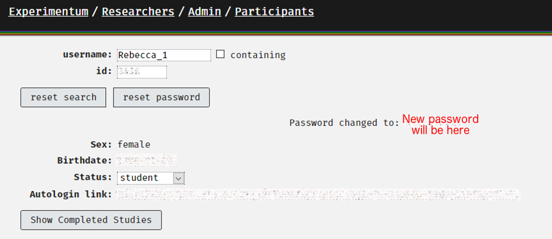
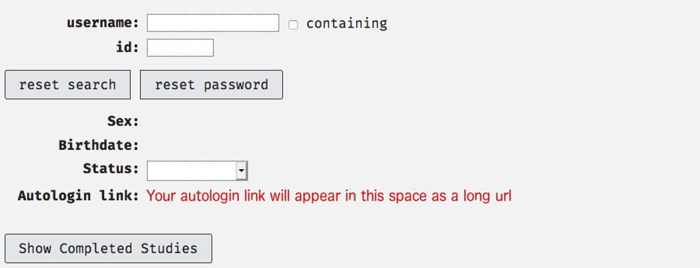

# Supervisor Cheatsheet {-}

## Overview {-}

This is a collection of sections from the document directed at the everyday operations that supervisors would need to carry out assembled in one place for easy reference.

If there is anything missing please file an issue on the GitHub codebase for this book by clicking [here](https://github.com/RebeccaJLai/exp_manual/issues).

## Admins {- #roles} 

Lisa is busy and Rebecca is contracted for 1 hour per week for Experimentum support. Much of the day-to-day of handling your students will fall on you, the supervisor. 

If you are not prepared to accept this you may need to consider using another system.

### Admin Responsibilities {-}

Our responsibilities are:

* To try to ensure smooth operation of the site with regards to technical difficulties and instruction of staff and students. 
    * We will hold workshops at specific time points throughout the academic year, update this manual and answer questions on Slack.
* To troubleshoot problematic issues experienced by staff and students.

### Supervisor Responsibilities {-}

* To ensure that you have a researcher account to supervise any of your students who wish to use the site.
    * You may be comfortable allowing some more senior and trustworthy students almost complete autonomy by granting them full researcher status but it is still advisable to have an account of your own. 
    ***If you wish for them to have full researcher status this must be confirmed by the supervisor to Rebecca directly, not through your student or third party.***
* To handle the day-to-day needs of your own students:
    * Ensure that you have the knowledge to know how to implement designs you expect your students to use through the site.
    * To check the standards of your students work.
    * To approve "student" researcher status of your own students.
    * To activate the projects of your own students, even when they deactivate them by making edits after an initial activation.
    * To manage your students expectations of what the site can provide (it will not be perfect or even workable for some types of study).
    
```{block, type = "warning"}
Supervisors should supervise their own students' accounts only, unless they have the expertise to double-check the veracity of the students' work and are prepared to accept the responsibilities outlined above for these students.
```
    
## Approving Student and Researcher Status Requests {-}

Supervisors have a responsibility to ensure that their students have the status that they require to carry out their projects. This includes assigning them sufficient permissions to construct and deploy their studies. 

Once the supervisor has "researcher" status they will have a new area of the website opened to them, accessible through the researchers' link in the menu on the right, which will contain a section called "Admin": 

<center></center>

Clicking on this button will take them to a page with more options. To see and make changes to the privileges of those who have requested you as a supervisor and requested researcher status select the option "Supervision" from the menu.

<center></center>

Here you will see a list of individuals who have requested you as a supervisor. To change their status, select the appropriate account type from the right-most drop-down menu under the column "Status".

<center></center>

The account you are making changes to will have to log out and back in again to be updated with their new permissions. When you press "Send" an email will be sent to the student to inform them of the status change.

```{block, type = "info"}
If you are a supervising member of teaching or research staff, you should request Lisa DeBruine or Rebecca Lai as your supervisor. 
More senior students who are relatively self-sufficient or have their own supervising duties may request "researcher" accounts *if you, their supervisor, agrees to it and contacts Rebecca about it directly*. No such request will be accepted on the word of a student or request via third party.

In such a case where this is agreed they should request Lisa or Rebecca as their supervisor as any other "researcher" account would.
```

## Activating Studies {- #activating}

### Is this study ready?: Student Checklist

Students should use the following checklist before they request their supervisor review and activate their study:

1.	Checked spelling and grammar across all components, sets and the project.
2.	Checked the stimuli presentation is correct and as expected within all components.
3.	Tested the order of presentation of components, including debrief/feedback using the test button outlined in the section [“Testing Your Study”](#testingyourstudy). 
4.	Run through the study (multiple times) as if they were a participant.
5.	Examined the test run data to ensure that they are getting exactly what they expect and that they can successfully interpret it.
6.	Saved a copy of their test data so that they can later exclude it, separating the test data from the real data.

### Making a Study Active

```{block, type = "warning"}
Once you activate a study for a "student" researcher account it cannot be edited without resetting it back to "test" status, essentially deactivating it.

Students should confirm that they are completely happy with the study before they ask you to activate it. This is why the checklist above has been provided to them.

When a student attempts to edit an active item this warning is displayed at the top of the page next to the "Save" button:


If a student makes a change to the study after activation, rendering it inactive, you the supervisor are the point of contact for the student to reactivate it. You may wish to check that the edits made have not impacted the quality of the project.
```

To activate the student's study, follow these steps:

1.	Login to your supervisor account.
2.	Navigate to the researcher’s section of the site using the menu at the right-hand side of the page:

<center></center>

3.	Next, go to the Projects section by using the Projects button on this page:

<center></center>

4.	On the Projects page, they will be able to find the names of your supervised students in the drop-down menu. They should select the student in question’s name:

<center></center>

5.	Projects that belong to the student will be displayed here. Click on the project that you want to be turned to active. Under the section that says “Status” it should currently read “test”. To change the entire project (including all sets and components within) select “active” from the drop-down menu and click the button next to it that says “Set all component statuses to project status”:

<center></center>
 
```{block, type = "warning"}
If you do not change all component statuses to active some will remain in test mode, leaving participants to only be able to access parts of the study and this will result in incomplete or missing data.
```

## Resetting Passwords {-}

Researcher status accounts also have permission to reset some passwords, found by searching in the “Participant Data” section in the admin page, but they should limit this to resetting the passwords of their own students or participants.

```{block, type = "danger"}
 You must be satisfied that the account holder is the person requesting the change of password.
 
In terms of students conducting research projects I would recommend that they present themselves to you in person to request a password change as these students have access to participant data.
```

To change a password, you can either:

*	Navigate to Researchers, then Admin and finally to Participants and search for either the entire or partial username or ID number and click “reset password” **or**

*	Find your student under your supervisory list by going to Researchers, then Admin, then Supervision and selecting their name from the list and selecting “reset password.

The new password will be displayed on the page straight away on the page:

<center></center>

<br>

```{block, type = "danger"}
This password is supposed to be temporary, but it does not expire. It should be changed as soon as possible as it will have likely be communicated via e-mail or will have been written down.
```

## Autologin Links {-}

Autologin links allow you to by-pass password verification and access the accounts of those that you supervise. These exist to allow admins and supervisors to log in to student’s accounts to examine their studies and help when required.

You can access your student’s autologin link by navigating to “Researchers” > “Admin” > “Supervision” and clicking on the student’s name from your list of supervisees:

<center></center>

Clicking on the autologin link will log you into the account of this user which allows you to examine what is going on in their account from the perspective of their account. This should be used for troubleshooting issues such as lack of access to the researchers section of the website and bugs that may be specific to their account or project(s). 

These links are the same ones that the admins use to examine user accounts.


