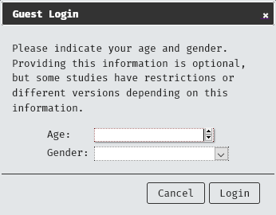

# Known Issues, Bugs and Common Errors{- #knownissues}

## Overview {-}

This is a list of issues that are known and that we are working on to fix. 

If you discover another issue that is not listed here you can report the issue [here](https://github.com/RebeccaJLai/exp_manual/issues)- but please check that it has not been reported before you open another issue for it.

## Common Errors {-}

### Data not being saved despite questions being completed.

In questionnaire components it has been occasionally reported that, despite completing all of the questions, participant data is not being saved and warnings are presented that not all questions have been filled in.

This issue has been traced to the use of HTML tags by users when formatting their questionnaires.

If you use HTML tags, you must ensure that you have matching opening and closing tags. Unmatched tags will prevent data from being recorded from this component.

```{block, type = "workaround"}
**Solution:** check your HTML formatting, ensure that all opening tags (`< >`) have matching closing tags (`</ >`).
```

## Issues... {-}

### Which do NOT interfere with the operation of the site {-}

These issues are bugs which do not prevent the intended function of the action being carried out at the time of their occurrence and are considered to be of low priority.

#### "The supervisor or supervised could not be found" when changing account type  {- #notfound}

This happens when a supervisor attempts to change the account type of a student from "registered" to "student". The account changes are carried out regardless of the message. 

To check this log out, log back in and then check the status of the student. 

```{block, type = "info"}
The account being changed must log out and then back in for any changes to take effect, regardless of whether you experience this bug or not.
```

### Which DO interfere with the operation of the site {-}

These issues are bugs which in some way inhibit the function of the site and are considered high priority for fixes and workarounds.

#### Social Media Links to Study Not Working {- #soc_med}

When posting a link to your study on some social media sites the link may not take the participant to your study. The site may tell you that the study does not exist or is not active.

This is due to some social media mobile phone apps also use their own built in-browser software, which is not compatible with Experimentum. Some will also make changes to the link when it is clicked on, which will direct the user to Experimentum, but it will be sent to a non-existent page resulting in the message that the study does not exist/is not active.

Meta products (Facebook, Instagram, etc) are the ones that we have the most difficulty with. 

Experimentum is not compatible with these lite-browsers. This is why the study link won't work directly from them.

```{block, type = "workaround"}

**Workaround:** You can provide the participant with the link to your study for them to copy and paste into their full-fat browser software (such as Samsung Internet, Firefox, Chrome, etc) instead of giving them a clickable link directly to the study.

Alternatively, some users have also had success by using redirection/link shortening services, such as [TinyURL](https://tinyurl.com/app), [Bitly](https://bitly.com/) and [Linktree](https://linktr.ee/).

```

#### Missing Data {-}

A number of system users have reported "missing data", however the data was later found to be misattributed to a different project. **Truly missing data is rare**. 

Data can be misattributed to a different study if participants are completing more than one study at the same time. Therefore, we recommend that you download your data from each of the individual components from your study rather than downloading the data from the entire project page- see [“Downloading Your Data”](#data). 

All data recorded under the individual components will be contained in the CSV file, regardless of what project it has been attributed to.

```{block, type = "info"}
You should also bear in mind that online studies are particularly prone to attrition, especially if they are longer in duration, repetitive or require high effort levels from participants. 

If you have concerns about missing data and have tried examining the data from individual components as above without success, contact the admins for [support](#support).
```

#### My questionnaire/responses to questions won’t save {-}

Occasionally the Javascript that allows us to save questionnaires stops working. 

We have yet to determine a pattern or cause for this.

Please save your questionnaires *frequently* to prevent any substantial loss of work (recommended to save every 3 questions added) or to consider using [bulk upload of questions](#addfromspreadsheet). You should save your questionnaires regularly to ensure that if this happens you won’t lose too much work. I recommend saving after every 2-3 questions.

Codes assigned to response variables (the number before the colon in the image below) should be unique within that question, otherwise they will overwrite each other, and duplicate options will be removed.

Editing options for responses to questions must be closed before you attempt to save the questionnaire by re-clicking the pencil icon next to the cog. You can tell that editing is open by the yellow colour surrounding the response options as below.

<center></center>

#### `user_age` displayed as "2020.1" {- #user_age}

There have been some instances where the age in the `user_age` column of a data set is logged as "2020.1". This is the age drawn directly from the system. 

The source of this bug is unknown, as the admins have not been able to directly replicate it. It has only been observed, however, with anonymous participation (guest users). I would suggest that it may be some artifact from the guest user login dialogue box:

<center></center>

```{block, type = "workaround"}
**Workaround:** It is recommended that you do not rely on this dialogue box or registered user details for the system to automatically provide participant ages. To prevent data loss, please include a separate age related question in your demographics questionnaire.
```

#### Video stimuli is not loading {-}

Video stimuli which is in excess of 3Mb may not load in good time, or may fail to load completely.

```{block, type = "workaround"}
**Workaround:** The site is designed to function with short snippets of video, not long clips. If you cannot compress your files to below 3Mb per stimuli item it is recommended that you host your larger files on other platforms (such as YouTube) and then embed them into a questionnaire component. 
```

#### Email Notifications {-}

Email notifications are not always sent. 

E-mails notifying students and supervisors of changes of account type work seemingly without issue. In particular, e-mails requesting supervisors accept researcher status requests and turn studies to "active" are not being sent or sent consistently.

```{block, type = "workaround"}
**Workaround:** Please e-mail your supervisor directly if you require researcher status or to review and activate your study.
```

#### Cannot Share Ownership of Components With Students {-}

At the moment it is not possible to share components with students. This stems from a work-around regarding access to and protection of data. Anyone who is an owner of a component may download the data gathered by it, even if that component is also used by others.

```{block, type = "workaround"}
**Workaround:** At the moment it is recommended that students create their own components to suit their needs or that the supervisor create any regularly used components, duplicate them and assign the duplicate to the student in need.

If you are using questionnaires you may want to consider creating a spreadsheet with the questions, following the templates discussed in the section about [adding questions in bulk](#addfromspreadsheet).
```

### Solved Issues {-}

Log of issues that have been resolved.

#### I can't access the site? {- #vpn}

Access to the researcher areas of the site now require on campus access. If you can see the site, but when you log in and try to access  researcher areas you get a "not found" error you should first make sure that you are either accessing the site from the campus network or using the VPN to connect securely to the campus network.

The means that you must access the site via a connection on the University of Glasgow campus, or if you are not physically on site, use the VPN to create a secure connection between your device and the university network.

You can find more information on how to use the VPN [here](https://www.gla.ac.uk/myglasgow/it/vpn/).

Participants who do not have researcher access will still be able to render data to active studies without issue.

#### `\\n` in Question Names in Downloaded Data: Solved 19/01/2021 {- #question_n}

```{block, type = "warning"}
DV names can no longer use `\\n`. These are now restricted to letters, numbers and underscores.

Previously existing DV names containing `\\n` have had the offending character removed.
```

This is a result of a new line being taken when you have entered the name of your questions during the construction of the study.

`\\n` is a reserved combination of characters, representing a new line being taken in a string. As such, this makes it difficult to process this in R.

You must "escape" the character in order to use it.

```{block, type = "workaround"}
**Solution:** replace the cells in your spreadsheet that contain the `\\n` symbol.

Download [the example spreadsheet and code](examples/recode_slashn.zip) for an example of *escaping* the `\\n` so that you can process your data without hassle.
```

#### One of (equal) preventing sets from running {- #oneofequal}

```{block, type = "warning"}
"One of (equal)" decision rule is no longer available for use in sets and projects.
```

The "one of (equal)" randomization. There has been a report of this preventing the set from working. On testing no items in the set were run, and no items shown in the "test" sampling of assignment to items in the set. 

```{block, type = "workaround"}
Unless there is a *strong theoretical basis* for attempting to recruit equal numbers of men and women into each item within a set it is suggested that you use "one of (random)".

If you need to recruit specific number of individuals into each item (where gender identification is not theoretically relevant) we recommend that you monitor the number of completions and work with your supervisor and admins to turn off specific components when the required number is reached.
```


