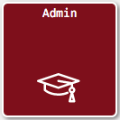
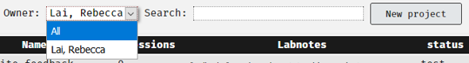

# Supervisor Cheatsheet {-}

## Overview {-}

This is a collection of sections from the document directed at the everyday operations that supervisors would need to carry out assembled in one place for easy reference.

If there is anything missing please file an issue on the GitHub codebase for this book by clicking [here](https://github.com/RebeccaJLai/exp_manual/issues).

Many of the operations that can be done with a student account can also be done with a supervisor or researcher account, such as constructing components, sets and projects and testing them. Please see the relevant sections of the manual for these items. 

## Admins {- #roles} 

Lisa is busy and Rebecca is contracted for 1 hour per week for Experimentum support. Much of the day-to-day of handling your students will fall on you, the supervisor. 

If you are not prepared to accept this you may need to consider using another system.

### Admin Responsibilities {-}

Our responsibilities are:

* To try to ensure smooth operation of the site with regards to technical difficulties and instruction of staff and students. 
    * We will do this by holding workshops at specific time points throughout the academic year, update this manual and answer questions on [Microsoft Team Experimentum channel](#support) .
* To troubleshoot problematic issues experienced by staff and students.

### Supervisor Responsibilities {-}

* **To ensure that you have a supervisor account to supervise any of your students who wish to use the site.**
    * You may be comfortable allowing some more senior and trustworthy students almost complete autonomy by granting them full researcher status but it is still advisable to have an account of your own. 
    ***If you wish for them to have full researcher status this must be confirmed by the supervisor to admins directly, not through your student or other third party.***
    * If a PhD student takes responsibility for supervising other students they will need to have their own supervisor account.
* **To handle the day-to-day needs of your own students:**
    * Ensure that you have the knowledge to know how to implement designs you expect your students to use through the site.
    * To check the standards of your students work.
    * To approve "student" researcher status of your own students.
    * To activate the projects of your own students, even when they deactivate them by making edits after an initial activation.
    * To manage your students expectations of what the site can provide (it will not be perfect or even workable for some types of study).
    
```{block, type = "warning"}
Supervisors should supervise their own students' accounts **only**, unless they have the expertise to double-check the veracity of the other staff members students' work and are prepared to accept the responsibilities outlined above for these students.

Admins will **not** absorb the extra workload for supervisors who refuse to use the system themselves want their students to use it.

If you do not want to establish your own account and use it to supervise your students you may wish to consider using a different system.
```
    
## Accessing Supervisees Projects, Sets and Components {-}

Once someone is registered as your supervisee you should be access the items that they have created. This allows you to see every project, set and component that they have made. To do this, navigate to the researcher’s section of the website using the panel on the left after login.

Next you should pick the option that is most applicable to your needs. If you are trying to access an experimental component, click on the experiments button, for questionnaires the questionnaire button and the same for sets and projects.
 
This will take you to a page where you can see the items of this type that you own by default. To see the items that belong to your supervisees, select their name from the drop-down menu at the top of the page:

<center></center>
 
Select the supervisee in question and then you will be able to see the items of that class that belong to them:
 
<center></center> 
 
You can now access this item by clicking on its name or number. You will be able to inspect, edit and test items.

## Approving Student and Researcher Status Requests {-}

Supervisors have a responsibility to ensure that their students have the status that they require to carry out their projects. This includes assigning them sufficient permissions to construct and deploy their studies. 

Once the supervisor has "researcher" status they will have a new area of the website opened to them, accessible through the researchers' link in the menu on the right, which will contain a section called "Admin": 

<center></center>

Clicking on this button will take them to a page with more options. To see and make changes to the privileges of those who have requested you as a supervisor and requested researcher status select the option "Supervision" from the menu.

<center></center>

Here you will see a list of individuals who have requested you as a supervisor. To change their status, select the appropriate account type from the right-most drop-down menu under the column "Status".

<center></center>

The account you are making changes to will have to log out and back in again to be updated with their new permissions. When you press "Send" an email will be sent to the student to inform them of the status change.

```{block, type = "info"}
If you are a supervising member of teaching or research staff, you should request Lisa \*Admin or Rebecca \*Admin as your supervisor. 

More senior students who are relatively self-sufficient or have their own supervising duties may request "researcher" accounts *if you, their supervisor, agrees to it and contacts Rebecca about it directly*. No such request will be accepted on the word of a student or request via third party.

In such a case where this is agreed they should request Lisa or Rebecca as their supervisor as any other "researcher" account would.
```

## Activating Studies {- #activating}

### Is this study ready?: Student Checklist

Students should use the following checklist before they request their supervisor review and activate their study:

1.	Checked spelling and grammar across all components, sets and the project.
2.	Checked the stimuli presentation is correct and as expected within all components.
3.	Tested the order of presentation of components, including debrief/feedback using the test button outlined in the section [“Testing Your Study”](#testingyourstudy). 
4.	Run through the study (multiple times) as if they were a participant.
5.	Examined the test run data to ensure that they are getting exactly what they expect and that they can successfully interpret it.
6.	Saved a copy of their test data so that they can later exclude it, separating the test data from the real data.

### Making a Study Active

```{block, type = "warning"}
Once you activate a study for a "student" researcher account it cannot be edited without resetting it back to "test" status, essentially deactivating it.

Students should confirm that they are completely happy with the study before they ask you to activate it. This is why the checklist above has been provided to them.

When a student attempts to edit an active item this warning is displayed at the top of the page next to the "Save" button:


If a student makes a change to the study after activation, rendering it inactive, you the supervisor remain the point of contact for the student to reactivate it. You may wish to check that the edits made have not impacted the validity or quality of the project, or how comparable data before and after the changes are.
```

To activate the student's study, follow these steps:

1.	Login to your supervisor account.
2.	Navigate to the researcher’s section of the site using the menu at the right-hand side of the page:

<center></center>

3.	Next, go to the Projects section by using the Projects button on this page:

<center></center>

4.	On the Projects page, they will be able to find the names of your supervised students in the drop-down menu. They should select the student's name:

<br>
<center></center>
<br>

5.	Projects that belong to the student will be displayed here. Click on the project that you want to be turned to active. Under the section that says “Status” it should currently read “test”. To change the entire project (including all sets and components within) select “active” from the drop-down menu and click the button next to it that says “**Set all component statuses to project status**”:

<br>
<center></center>
<br>
 
```{block, type = "warning"}
If you do not click  "**Set all component statuses project status**" the project will be activated but not the components within.

This means that participants will not complete the components and no data will be gathered for them.
```

## Sharing Components {-} 

In some cases you may wish to share components that you have pre-made with other users, but this can present difficulties.

Due to the way that data is attributed to components, if you add an owner to your items, they will be able to see and download all of the data collected by an item that you have added them to. This is obviously not what we want for the purposes of data protection, unless the person you are sharing with is a collaborator on your project and entitled to access this data.

What we currently recommend is that, in cases where the person you are sharing with is not authorised to the data collected by your component, is that you **duplicate** the component using the duplicate button in the component information page:

<center></center>

This new duplicate component is essentially a new component, divorced from the data collected by the previous one. You can now add another owner to this by searching for their name in the box, as shown here:

<center></center>

Once you have added that person you can then press delete next to your own name should you wish to remove yourself.

```{block, type = "info"}
If you intend to regularly assign the same questionnaires or experiments to level 3 and 4 students for project work, and do not expect them to make their own from scratch each time, it may be an idea to construct your own stock of components and duplicate and share them in this way.
```

## Resetting Passwords {-}

In instances where registered users have forgotten their password they should normally reset the password themselves using the [lost password instructions](#lost_password).

In a limited number of cases this will not be an option, for example, if the email inbox of the user in question is not accessible.

Researcher status accounts also have permission to reset some passwords, found by searching in the “Participant Data” section in the admin page, but they should limit this to resetting the passwords of their own students or participants.

```{block, type = "danger"}
 You must be satisfied that the account holder is the person requesting the change of password.
 
In terms of students conducting research projects I would recommend that they present themselves to you in person and/or produce a valid student ID to request a password change as these students have access to participant data.
```

To change a password, you can either:

*	Navigate to Researchers, then Admin and finally to Participants and search for either the entire or partial username or ID number and click “reset password” **or**

*	Find your student under your supervisory list by going to Researchers, then Admin, then Supervision and selecting their name from the list and selecting “reset password.

The new password will be displayed on the page straight away on the page:

<center></center>

<br>

```{block, type = "danger"}
This password is supposed to be temporary, but it does not expire. It should be changed as soon as possible as it will have likely be communicated via e-mail or will have been written down.
```

## Autologin Links {-}

Autologin links allow you to by-pass password verification and access the accounts of those that you supervise. These exist to allow admins and supervisors to log in to student’s accounts to examine their studies and help when required.

You can access your student’s autologin link by navigating to “Researchers” > “Admin” > “Supervision” and clicking on the student’s name from your list of supervisees:

<center></center>

Clicking on the autologin link will log you into the account of this user which allows you to examine what is going on in their account from the perspective of their account. This should be used for troubleshooting issues such as lack of access to the researchers section of the website and bugs that may be specific to their account or project(s). 

These links are the same ones that the admins use to examine user accounts.

```{block, type = "warning"}
Autologin links should be used as the last resort when no other options for troubleshooting are available.

These should never be saved anywhere on your computer or made public as this would constitute a serious data protection or security risk.
```

