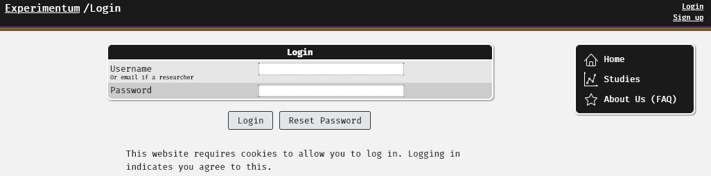
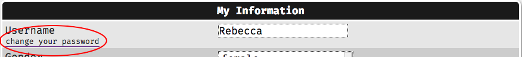
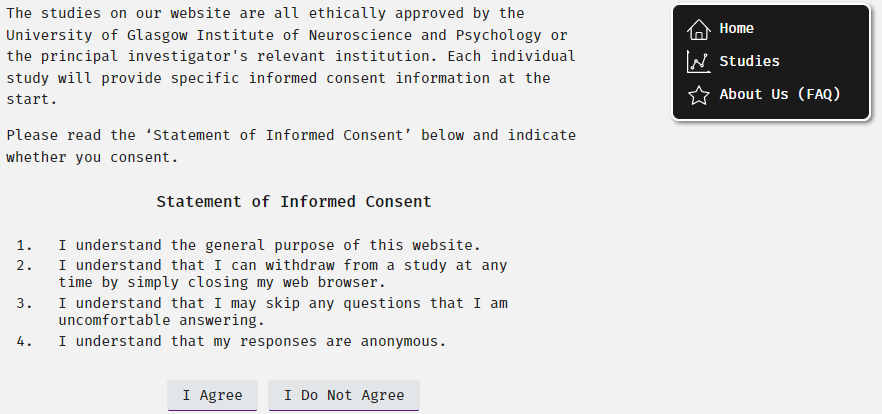

--- 
title: 'Experimentum: Web-based Software for Psychological Studies'
author: "Lisa DeBruine, Rebecca Lai, Benedict Jones, Rifah Abdullah, Gaby Mahrholz."
date: "`r Sys.Date()`"
documentclass: book
link-citations: yes
bibliography:
- book.bib
- packages.bib
site: bookdown::bookdown_site
biblio-style: apalike
---

# About Experimentum {-}

```{r include = FALSE, eval = FALSE}

# automatically create a bib database for R packages
knitr::write_bib(c(
  .packages(), 'bookdown', 'knitr', 'rmarkdown', 'pander'
), 'packages.bib')

# auto-populate list of the input files when rendering the book
input_files <- list.files()[endsWith(list.files(), ".Rmd")]

bookdown::render_book(input_files)
```

### Getting Support {- #support} 

#### For Experimentum @ University of Glasgow Users {-}

Currently there are two active admins available to provide support, these are [Rebecca Lai](mailto:rebecca.lai@glasgow.ac.uk) and [Professor Lisa DeBruine](mailto:lisa.debruine@glasgow.ac.uk).

Admins play a double role. In addition to helping you with Experimentum we are active researchers and teaching staff with additional jobs to do elsewhere. Our inboxes are often full, and emails will often go unread. 

As a result of this, all students and staff who are experiencing technical issues should use the Slack workspace ["Experimentum-web"](https://experimentum-web.slack.com/) to get support. Additionally, we are using the queries on the slack workspace to best update the user documentation, so it is important to keep all correspondence in one neat location.

```{block, type = "rainbow"}
You should never post data on this workspace, either in data file or screenshot form, as this would be a violation of the GDPR. All such files will be removed and your supervisor will be informed. 

If you need to share your data please use one of the university approved services available to you, such as OneDrive or OwnCloud.
```

#### Lost Passwords {- #lost_password}

You can now reset your password without having to consult a system admin. You can do this by going to the login page, supplying your user ID or email address in the "Username" box and pressing the "Reset Password" button, as shown below:

<center></center>

```{block, type = "warning"}
If you have reset your password you will be supplied with a randomly generated one to your *registered email address*.

You should change this as soon as possible, if not immediately.
```

If you do not have access to the registered email inbox please speak to your supervisor or the admins who may be able to reset your password for you on production of valid ID.

#### Changing Your Password {-}

You can change your password by signing in, navigating to "My Account" from the menu on the right of the page and clicking the link "change your password" under "Username":

<center></center>

#### Tutorial Sessions {-}

During times of particularly heavy use through the academic year we may schedule specific help sessions to deal with common issues and to help you fix specific problems that you might have. These will be advertised on the Slack workspace and on appropriate Moodle pages.

If you are experiencing an issue that is particularly difficult to fix remotely, you can make an appointment with Rebecca via private message on the ["Experimentum-web"](https://experimentum-web.slack.com/) workspace. However, you should have made attempts to solve the issue remotely first as time available for these appointments is extremely limited.

If you require assistance to navigate this document or create your study due to disability please contact your supervisor who may refer you to the admins.

#### For Other Users @ Other Institutions {-}

If you download and use the code for this platform you should establish clear guidelines outlining the role of the admins and methods of support in accordance with any relevant regulations. 

Staff from the University of Glasgow will not provide support for users of other systems based upon this code. Our Slack workspace is for internal use only.

```{block, type = "rainbow"}
Experimentum is an evolving platform.

If you find an issue with the Experimentum codebase, you can file an issue [here](https://github.com/debruine/experimentum/issues).

If you find an issue with the codebase for this manual, including missing or unclear information, you can file an issue [here](https://github.com/RebeccaJLai/exp_manual/issues).
```

## Privacy Notices {-}

### Cookies {-}

Cookies are used for Experimentum to allow us to track user sessions, which allows participants to navigate between pages during a session without having to log in to every page. In the case of anonymous logins, the session is tracked to maintain the same identity across multiple elements of the same study.  

Cookies are not tracked beyond a single session, for either registered or anonymous participants. By closing the browser the current session is ended and cookies tracking the session are discarded.

Cookies are not used in any other way by us, and the information is not retained or shared with any other organisations.

### Data Management {-}

#### For Participants {-}

The University of Glasgow guidelines with regard to data protection are available to view [here](https://www.gla.ac.uk/myglasgow/dpfoioffice/) and more general data management guidelines [here](https://www.gla.ac.uk/myglasgow/datamanagement/rdmatglasgow/). Researchers must adhere to these when collecting, processing, storing and using your data.

If you have any questions about your data your first point of contact should be the researcher who collected it. Contact details will be given in the studies you take part in. Researchers are ethically and legally obligated to answer your questions about your data.

##### About your data {-}

With all account types, besides anonymous participation, your user ID is linked to the data that you submit. This allows us to track users in multi-part studies, but it also means that our servers will contain multiple bits of information about you built up through your participation.

Individual researchers will only be able to access the data that you submit on their studies, and not data you submit to studies belonging to other researchers. In real terms, this means that individual researchers will only see the data that you give to them, not the data that you give across the entire site.

In cases where you participate in multiple studies for the same researcher, they will be able to see your data across these studies. Individual researchers are responsible for the protection of your privacy, ensuring that there is no way for any third party to use this information to "triangulate" your identity using the information you have provided. 

If you have any concerns about how your data is used please contact the researchers involved in the study or studies that you are taking/have taken part in. To see the University's guidelines on how researchers should treat data see [here](https://www.gla.ac.uk/myglasgow/dpfoioffice/). 

```{block, type = "warning"}
You have rights concerning your own data and how it is used, and responsible researchers should always hold these in the highest regard.

If you have any concerns about how your data is being used you should contact the researcher in question in the first instance. 

If you are reluctant to speak to them directly you can speak to their supervisor, whose contact information should be given to you at the time of undertaking the study or upon request from the researcher. 

Alternatively, you can contact the Data Protection and Freedom of Information Office [here](https://www.gla.ac.uk/myglasgow/dpfoioffice/contact/).
```

#### For Researchers {-}

Your study's data is your responsibility. Please ensure that it is protected and used appropriately. The University of Glasgow guidelines with regard to data protection are available to view [here](https://www.gla.ac.uk/myglasgow/dpfoioffice/) and more general data management guidelines [here](https://www.gla.ac.uk/myglasgow/datamanagement/rdmatglasgow/).  

Experimentum saves your data to the University of Glasgow School of Psychology secure servers, which are on-site within the department. Data will be output in Comma Separated Value (.csv) files in "tidy" format and is available for download from by the researcher(s) who own the study, their supervisors and admins **only**.

Whilst data processing questions should be directed to the researcher (or your supervisor(s) and advisors if you are a student/researcher), there are a couple of common tasks that you might find yourself needing to do. See the examples in the section [Commonly used R code](#commoncode) for help with some common code segments.

### Consent {-}

Upon registration, users are asked to complete a standardised consent form:

<center></center>
 
When constructing studies, you should also include your own consent form, including all relevant information specified by your supervisor(s) and regulatory body relevant to your work.

Consent forms usually take the form of an additional mixed questionnaire component presented at the start of your study.

## Citing Experimentum {-}

Lisa DeBruine, Rebecca Lai, Benedict Jones, Rifah Abdullah, Gaby Mahrholz. (2020). Experimentum (Version v.0.2). Zenodo. doi:10.5281/zenodo.2634355

## Codebase {-}

<a href="https://creativecommons.org/licenses/by-sa/3.0/legalcode"></a>

Open code for the site and installation instructions are available to download [here](https://github.com/debruine/experimentum). This is provided under a [CC-BY-SA 3.0](https://creativecommons.org/licenses/by-sa/3.0/legalcode) license.

The same is provided for this user guide [here](https://github.com/RebeccaJLai/exp_manual), and under this same [license](https://creativecommons.org/licenses/by-sa/3.0/legalcode). This document was authored using bookdown [@R-bookdown]. See [here](https://bookdown.org/yihui/bookdown/) for instructions on making modifications, rendering and publishing such documents.

## Author Contributions/Roles {-}

Rebecca Lai: project admin, validation, visualisation, writing draft, writing editing.
Rifah Abdullah: writing draft, writing editing.
Gaby Mahrholtz: writing draft, writing editing.
Benedict Jones: Conceptualization, funding acquisition, investigation, methodology, project admin, resources, supervision, validation.
Lisa DeBruine: All except original draft writing.

## Acknowledgements {-}

```{r echo=FALSE, message = FALSE}

library(tidyverse)

read_csv("misc_files/acknowledgments.csv") %>%
  arrange(surname) %>%
  unite(col = "name", c(first_name, surname), sep = " ") %>%
  mutate(`Our thanks to:` = paste0(name, ": "),
         ` ` = Deeds) %>%
  select(`Our thanks to:`, ` `) %>%
  knitr::kable()
```
 
 